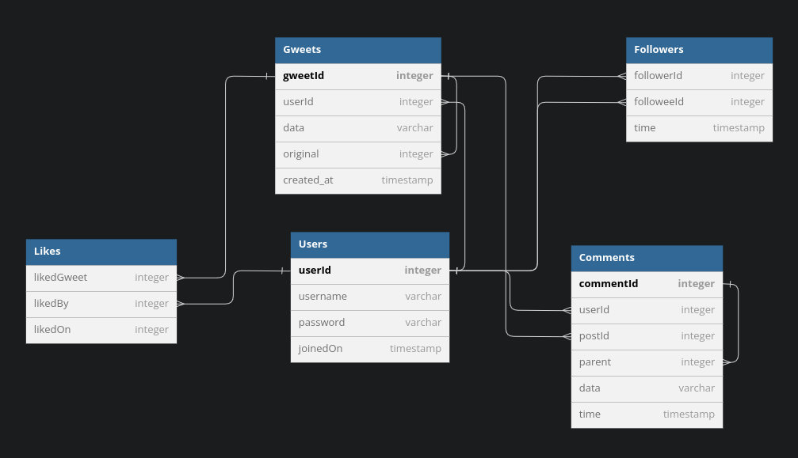

# Week 1 - Database Design
## SQLite
SQLite is an open source SQL database engine that can be incorporated into various application. It also provides a command line shell for quickly creating and querying databases. Once installed the shell utility can be invoked by running `sqlite3` command if the version installed is 3.x. SQLite operates on database files by parsing SQL queries, which can be provided through a file or through the shell utility.

## Gwitter Database
Gwitter is a twitter-like social media platform. The backend storage is handled by SQLite with a database modelled as follows:



Following indexes are created to facilitate faster query processing.
```
username on Users(username)
userId on Gweets(userId)
gweetId on Comments(gweetId)
follower on Followers(followerId)
followee on Followers(followeeId)
likedBy on Likes(likedBy)
```