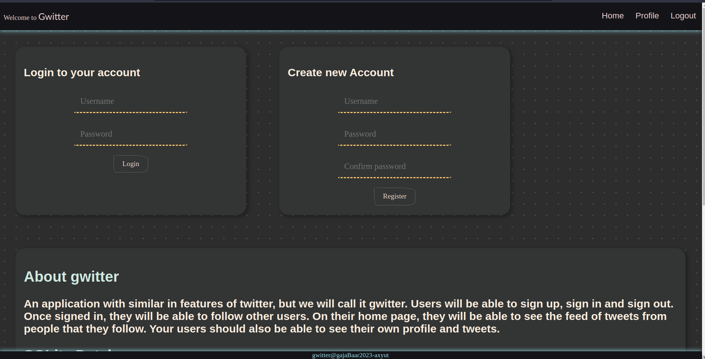
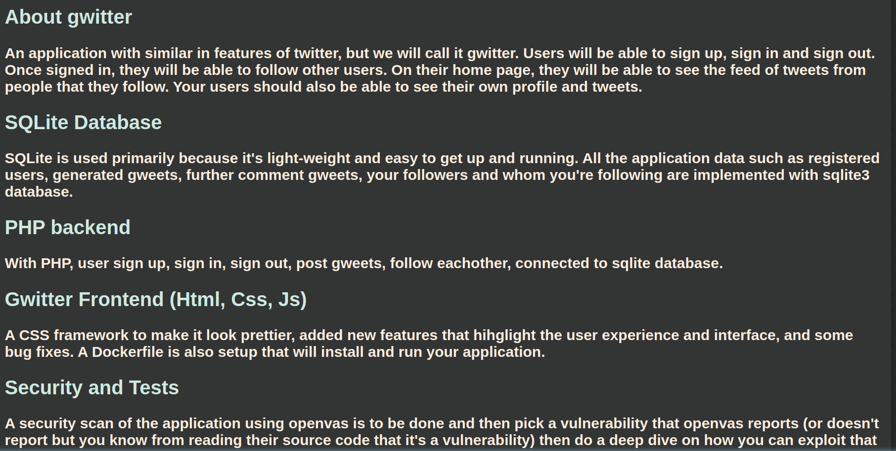
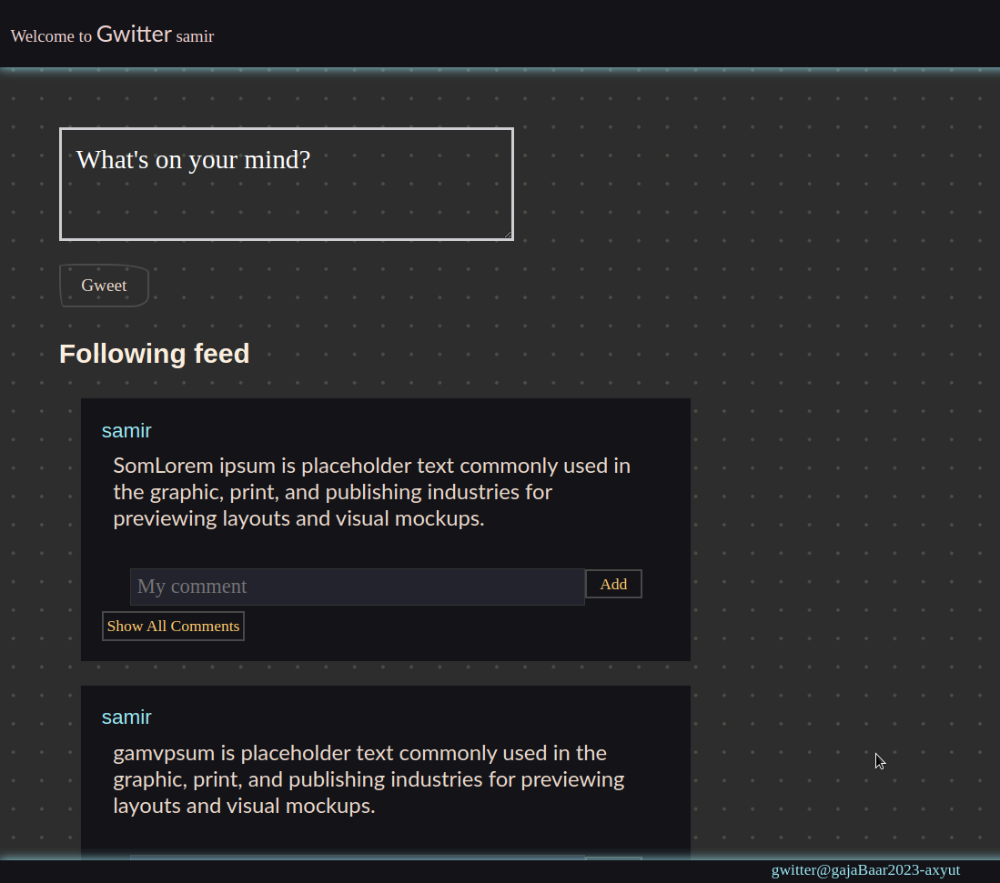
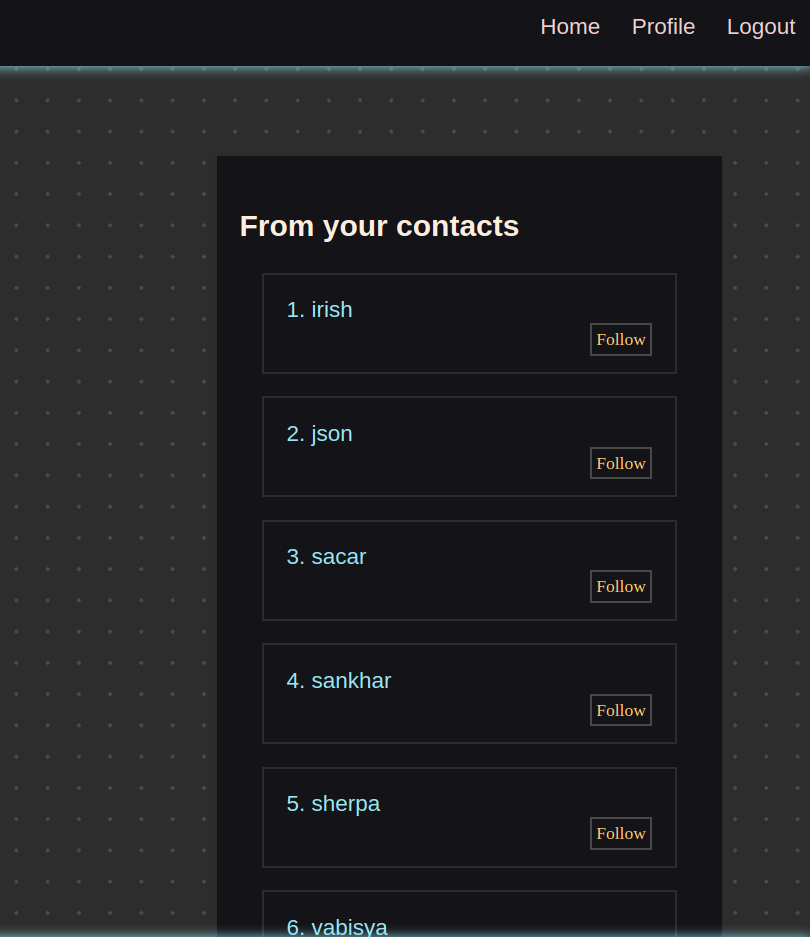
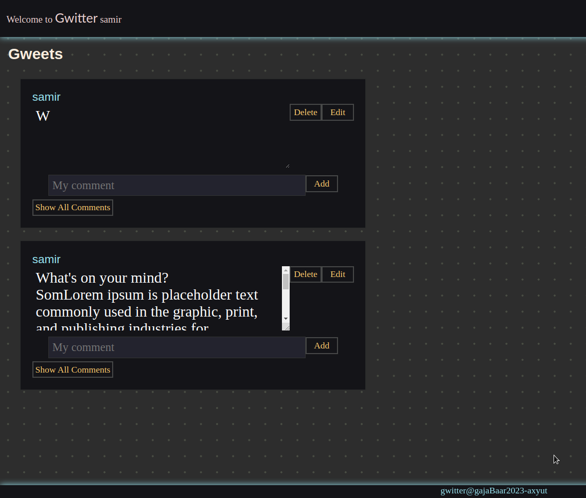
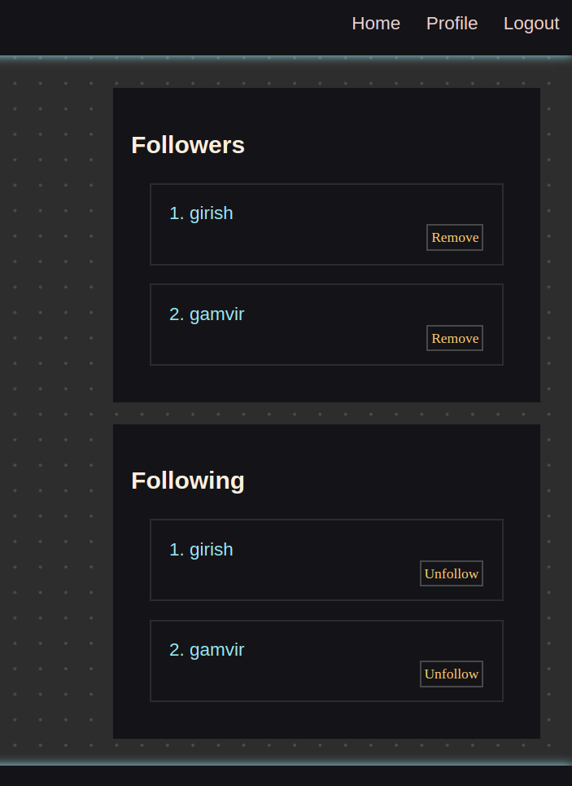
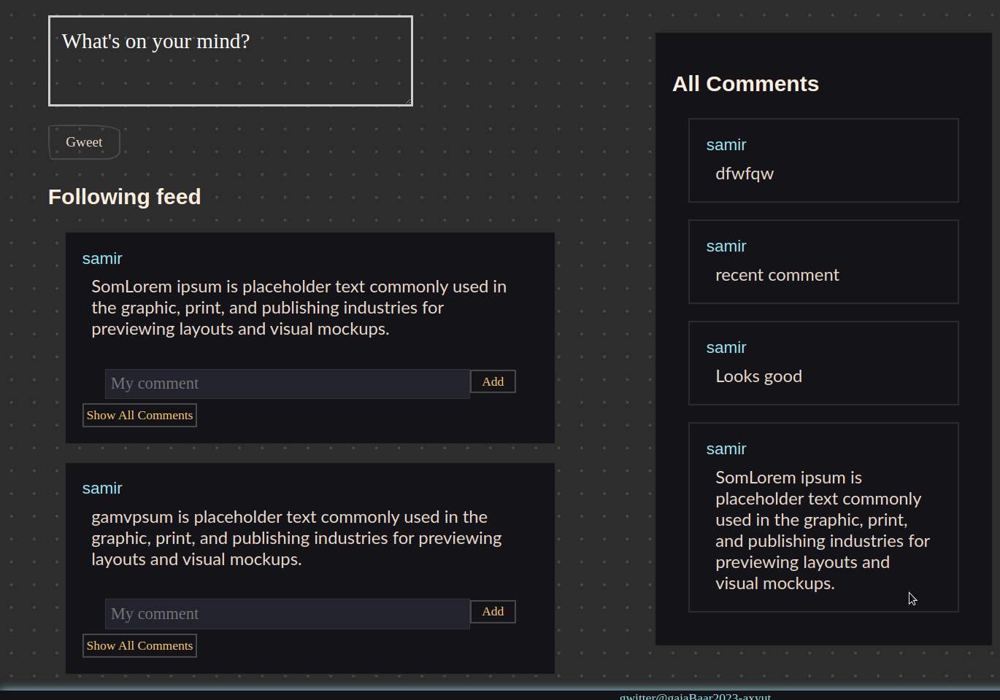

# Reports

## Week 2, 3 - Integrating Php and HTML CSS

This is a report that says how the website is supposed to look and function, what changes were made and what other changes can be done that are on the Todo list.

### Basics of PHP

- PHP is backend language that gives developers the flexibility to work on the frontend simultanously as well (for smaller projects).
- To run php on local machine we can use servers like php or apache, with php server can be started from working directory with `php -S 0.0.0.0:80 -t .` as for apache, we need to setup our working directory to /var/www/html and start the apache service/server on our machine

### Files

Multiple files has been added after previous database configuration, even the changes has been made to previous database file to make them work and configure with docker.

- File `index.php` in the root directory is the home/root of the website that acts like frontpage with login and registering functionality together.
- File `Dockerfile`, includes the building blocks of the docker image for our website.
- File `docker-compose.yaml`, is added to make the port binding of the host and local server easier while runnig docker container.
- File `build-docker.sh`, is a bash file that contains few lines of commands to execute the `Dockerfile` and `docker-compose.yaml` file easily for the Developers. We can just execute the file and docker setup will complete automatically.
- Folder `includes` includes two files, `header.php` and `footer.php` as the name suggets, they are imported to other pages for easier use of the navigation bar and footer bar
- Folder `pages` includes two files, `Home.php` and `profile.php`, they are the only two pages of our wesbites, `home.php ` welcomes user when he/she logins and `profile.php` has all the information about the user himself.
- Folder `utils ` includes five files, each to perform any task tha user wants to carry out, these files essentially make query requests to database and give back the response by modifying according to user's role.

### Functions

The tables user, post, comment, follower and following are put in place to maximize the functionality and speed of query execution.

- `Add gweets` users can add gweets with title upto 1-240 words to their profile, these gweets will appear for everyone the follows the user.
- `Delete Gweets` any gweet that the user has added can be deleted with delete button.
- `Edit Gweets` If the user is not interested in deleting the gweet he/she can edit and keep it in their profile.
- `Add comments` users are able to comment to their own gweet as well as others gweets
- `Followings` Users can follow any other people they haven't already followed and also unfollow them if need be.
- `Followers` User can see the follower that he/she have on the profile, User can also remove follower if they are not likeable.

## Working

Preview of how the website looks at the end of week 3.

- ### Gwitter Front page
  - #### Login, Register
    You can Login, register and read about Gwitter's policy, its wokrking mechanism and its views.
    
  - #### About
    
- ### Home Page
  All the gweets from the people you follow will appear here also you can post gweets and comment on other's gweets here. At side, People you may know will appear and you can follow them pressing the follow button.
  - #### Post Gweets, and Comment on other's Gweets
    
  - #### Contacts You would like to follow
    
- ### Profile Page
  This is your profile page where all the gweets you ever posted will appear. You can see the Peoples you follow and also your followers directly at the side.
  - #### My Gweets
    
  - #### My Following and Followers
    
- #### Comments
  You can comment on your gweets as well as other peoples gweets and the comments will appear like this on the side for any `See All Comments` button you select for.
  
