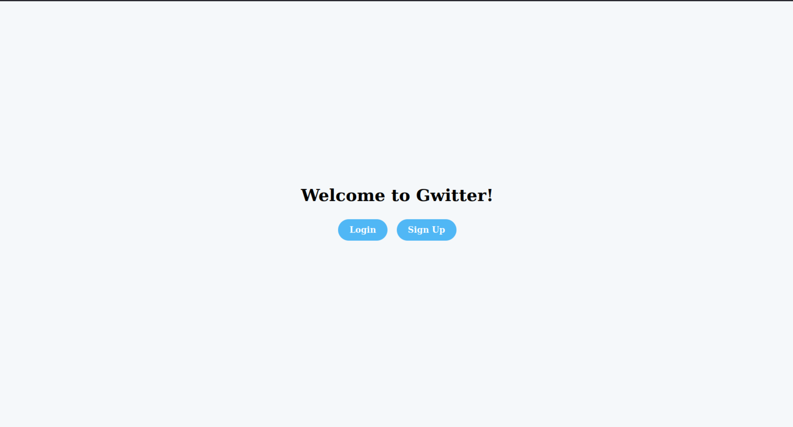
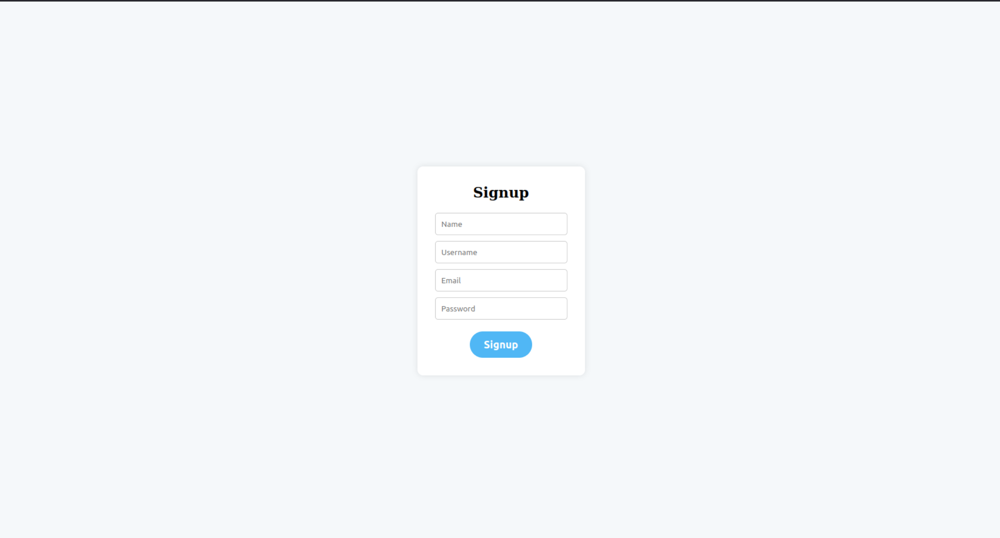
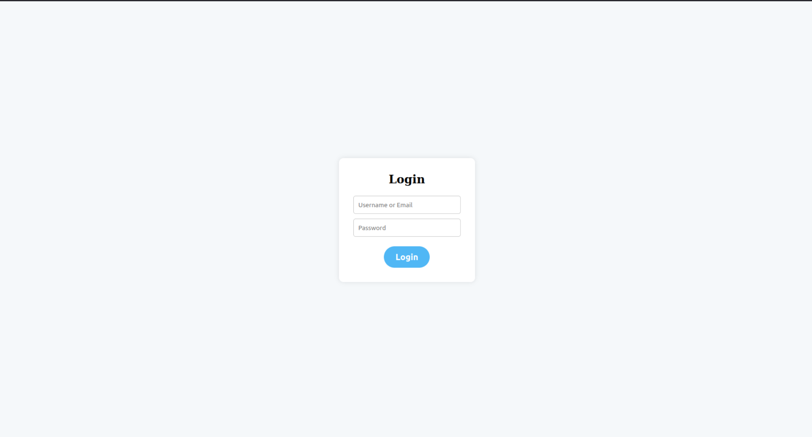
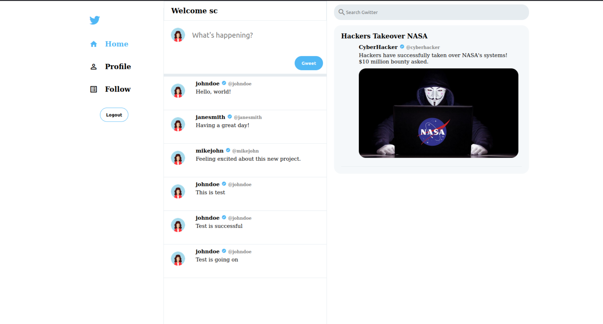
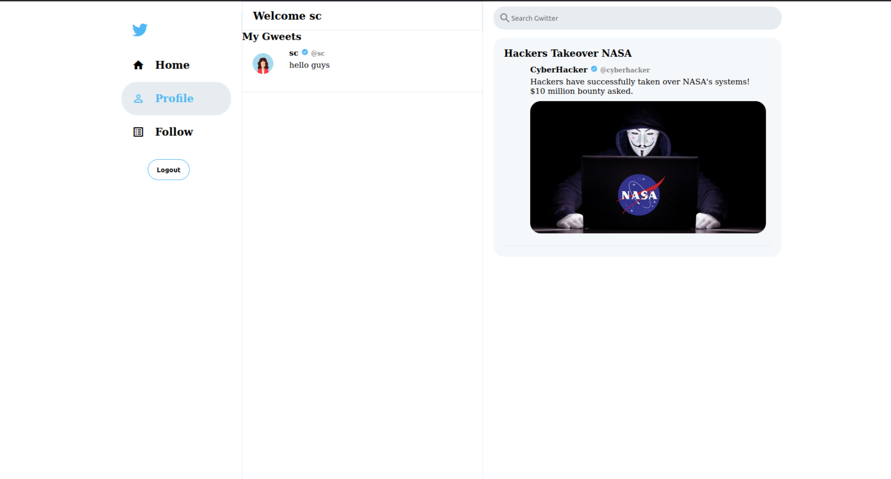

# Gwitter 
Just run `build-docker.sh` file. Gwitter can be accessed at `localhost:8000`
```bash
bash build-docker.sh
```
You can login using   `username : johndoe`   and   `password : password123` or create a new account

Intially your feed is empty. Follow some users to see their gweets on your feed. You can also create your own gweets.





