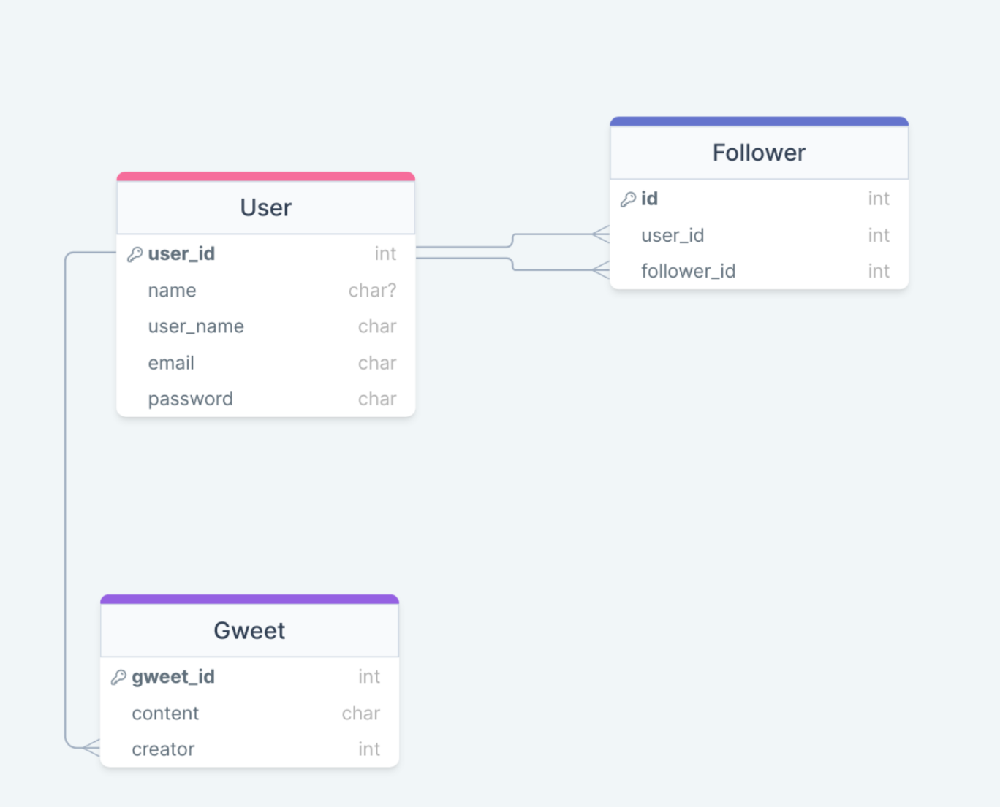

### Database Design
- Gwitter database consists of 3 tables:
  - `User` table to store the user information.  
  - `Gweet` table to store the tweet information
  - `Follower` table to store the followers of different users
  

### Using the Database
For creating and using the database follow given steps:
- Install sqlite on your linux machine
```bash
sudo apt install sqlite3
```
- Copy the `*.sql` files into the folder where you are creating the database and open the folder
- Create the database using command `sqlite3 db_name.db` inside the folder. The sqlite terminal app will open.
  Inside it use given commands to create and populate the database
  ```sqlite3
  .read Gwitter.sql   #creating the database
  ```
  ```sqlite3
  .read data.sql      #populating the database
  ```
- Contents of the database tables can be retrieved by running given queries in the sqlite terminal
  ```sqlite3
  SELECT * FROM User;       #Get all users
  SELECT * FROM Gweet;      #Get the gweets by all users
  SELECT * FROM Follower;   #Get the followers of all users
  ``` 