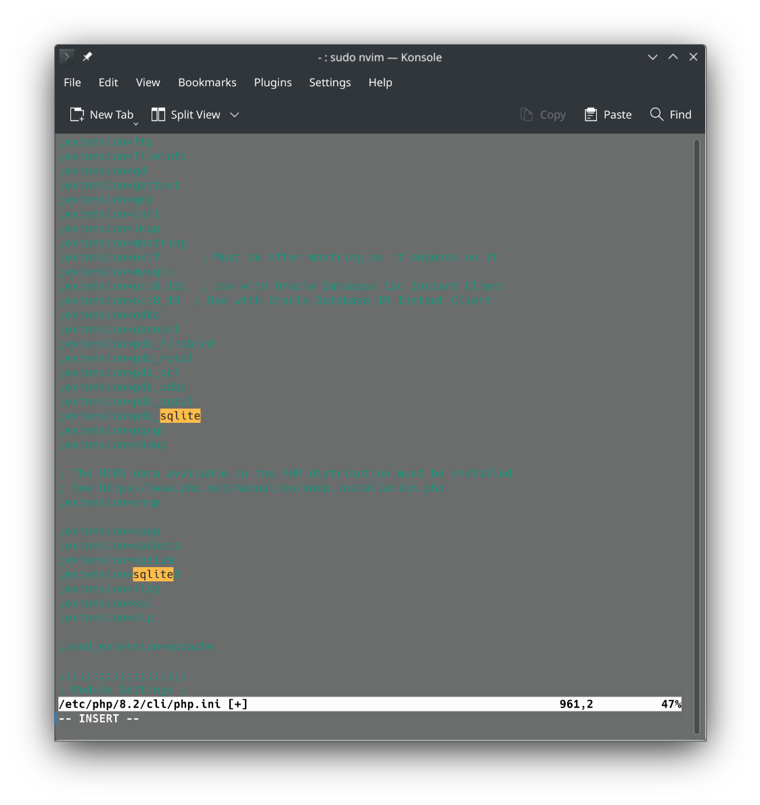

# Gwitter
Gwitter is a homologous project of twitter where users can gweet, see other's gweet, follow each other, like and comment on each other's gweet.

## Weekwise Distribution

We have divided development of gwitter into several weeks as follows.
### Week 1

In week 1 we got familiarize with relational and non-relational database. We designed the database, and performed CRUD operations.

To Delete entire table

``` DROP TABLE tablename;```

To Rename a table 

```ALTER TABLE tablename RENAME TO newtablename;```

To Delete data from a  table

```DELETE FROM tablename;```

To know the table structure

```PRAGMA table_info (tablename);```

To display all the datum inside a table

```SELECT * FROM tablename;```

To show tables

```.tables```

To exit

```.exit```

Ps:
If you haven't used sqlite before then you need to enable sqlite3 extension which can be achieved as

``` sudo nvim /etc/php/8.2/cli/php.ini ```

You can use any text editor, i have used nvim here.
Then you should see interface something like

Now uncomment the line by removing `;`

### Week 2

In week 2, we got familiriaze with php login system. We used `php server` to run our code in localhost instead of `apache` server as it provides error details such as

In order to run your code using php server you need to first install php server which can be achieved on debain based system as
`php -S 0.0.0.0:8000 -t .`
here `0.0.0.0` indicates the `localhost` and `8000` indicates the port number `.` identifies as the current directory.

We create login authentication and search system in this week and alligned it with sqlite3 database.

### Week 3

This week added extra features such as commenting on other's tweet, following them and liking the other's tweet.

## Setup

First clone the repository using

``` git clone <repository_url> ```

Then run

```cd ./1.gwitter/jamesii1234```

```chmod +x docker.sh && ./docker.sh```

On your browser
```localhost:8000```

You would see the webapp running.

