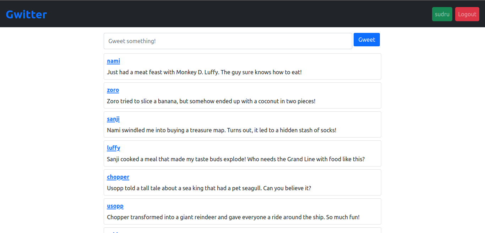
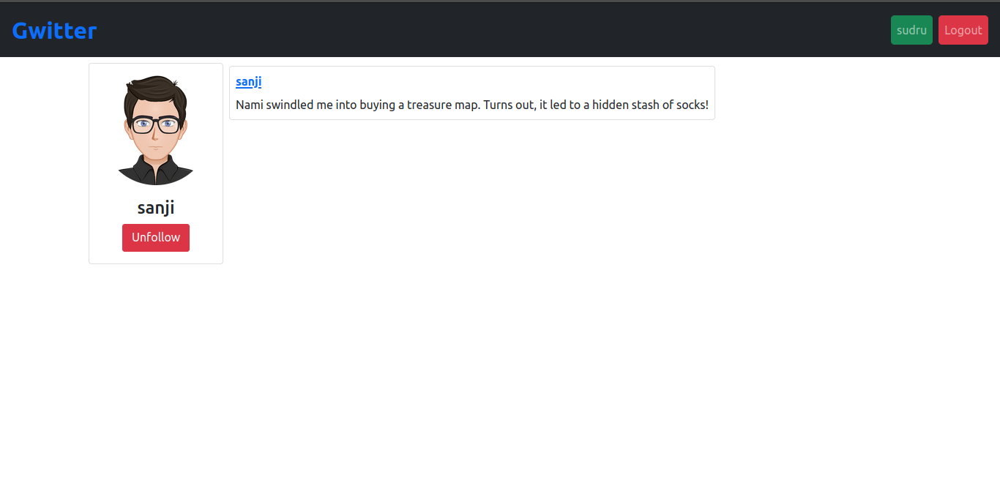

# Week 1:

**The task for Week 1 was to design the database for the Gwitter app.**

- The features defined for the app were: Signup, Login, Follow, and Post Gweet.

- For this I created 3 tables:
#### 1. users

- id 		=> integer and primary key
- username  => varchar and unique
- password  => varchar

This table handles the feature of Signup and Login.

#### 2. gweets

- id 	  => integer and primary key
- gweet   => text. Stores the actual gweet by users.
- user_id => integer and foreign key to reference the `id` in **users** table. Identify which user posted the particular gweet.

This table manages the gweets posted by users.

#### 3. followers

- uid => integer. Indicates a particular user who is being followed.
- followed_by => integer. Indicates the user who follows the user with `id`=`uid`.

- Both `uid` and `followed_by` references the `id` in users table as foreign key.
- unique pair of (uid,followed_by) to ensure a single user cannot follow same user twice.

This tables contains information about the followers and following list.

> On delete Cascade is used on foreign key to delete the gweets and followers table entry when the user is deleted.

- The schema to create the tables with these constraints is [schema.sql](../database/schema.sql).
- SQL query to insert dummy data into the tables are in [data.sql](../database/data.sql).
- The instruction for creating database and populating the data are explained in [README](../database/).

# Week 2:

**The task for Week 2 was to develop functionality for Gwitter**

For this I created the following files:
#### 1. [register.php](../register.php):

- Contains UI and logic for registering new user.

#### 2. [login.php](../login.php):

- Contains UI and logic for user login and session creation.

#### 3. [index.php](../index.php):

- Home page shown after successful login.
- Contains gweets posted by different users.
- Section to post new gweet.

#### 4. [profile.php](../profile.php):

- View username and their corresponding gweets.
- Follow and unfollow users.

#### 5. [logout.php](../logout.php):

- Logout and clear session.

# Week 3:

**The task for this week was to make docker file and build script file**

For this I created 2 files:

#### 1. [build-docker.sh](../build-docker.sh):

- This removes any existing image named `gwitter-sudru`.
- Builds image from the Dockerfile.
- Then run the application from the image at `http://localhost:8080`.

#### 2. [Dockerfile](../Dockerfile):
- Starts from php:8.1 as base image.
- Copy all the application files into the image.
- Installs the necessary dependency for sqlite3 in the system.
- Load schema into the database and also insert dummy gweets.
- Then runs application with command `php -S localhost:80`.
