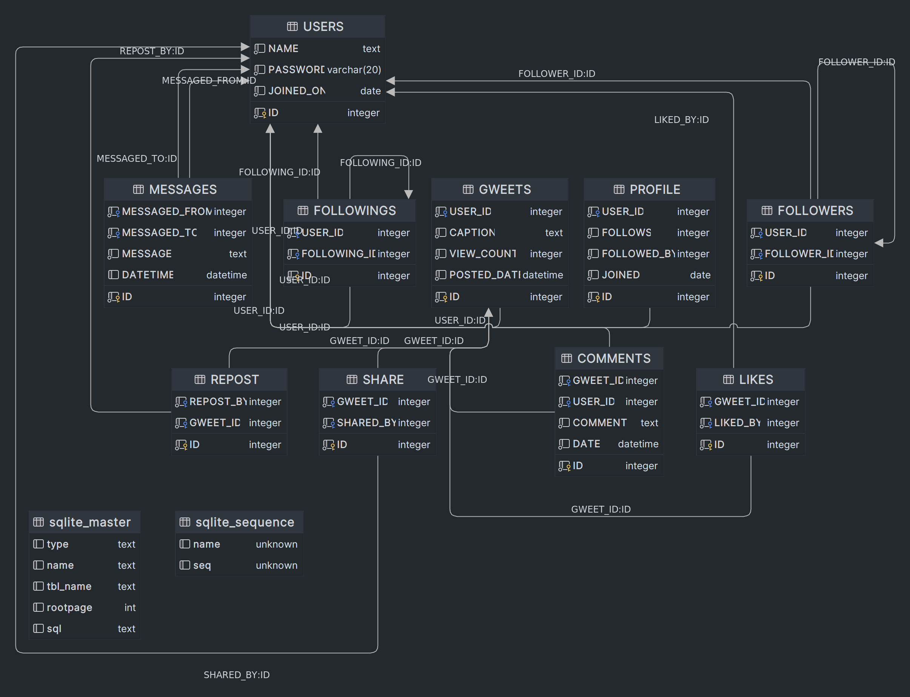

# Database Design Report

## Database Design

Here's a summary of each table and its **columns**:

1. COMMENTS:

   **Columns**: ID (primary key), GWEET_ID, USER_ID, COMMENT, DATE

   **Foreign Keys**: USER_ID references USERS(ID), GWEET_ID references GWEETS(ID)

2. FOLLOWERS:

   **Columns**: ID (primary key), USER_ID, FOLLOWER_ID

   **Foreign Keys**: USER_ID, FOLLOWER_ID both reference USERS(ID)

3. FOLLOWINGS:

   **Columns**: ID (primary key), USER_ID, FOLLOWING_ID

   **Foreign Keys**: USER_ID, FOLLOWING_ID both reference USERS(ID)

4. GWEETS:

   **Columns**: ID (primary key), USER_ID, CAPTION, VIEW_COUNT, POSTED_DATE

   Foreign Key: USER_ID references USERS(ID)
   CHECK constraint: VIEW_COUNT >= 0

5. LIKES:

   **Columns**: ID (primary key), GWEET_ID, LIKED_BY

   **Foreign Keys**: LIKED_BY references USERS(ID), GWEET_ID references GWEETS(ID)

6. MESSAGES:

   **Columns**: ID (primary key), MESSAGED_FROM, MESSAGED_TO, MESSAGE, DATETIME

   **Foreign Keys**: MESSAGED_FROM, MESSAGED_TO both reference USERS(ID)

7. REPOST:

   **Columns**: ID (primary key), REPOST_BY, GWEET_ID

   **Foreign Keys**: REPOST_BY references USERS(ID), GWEET_ID references GWEETS(ID)

8. SHARE:

   **Columns**: ID (primary key), GWEET_ID, SHARED_BY

   **Foreign Keys**: SHARED_BY references USERS(ID), GWEET_ID references GWEETS(ID)

9. USERS:

   **Columns**: ID (primary key), NAME, PASSWORD, JOINED_ON
   CHECK constraint: length(PASSWORD) >= 6

## Why I have design such database?

I have designed this database to create a Twitter-like platform. With this database, users can create accounts, share gweets, interact with others, and exchange messages. The USERS table stores user information such as names, passwords, and registration dates. The GWEETS table tracks gweets with details like captions, view counts, and posting dates. The COMMENTS table allows users to leave comments on gweets, while the LIKES table records users' likes on specific gweets. The FOLLOWERS and FOLLOWINGS tables establish relationships between users, enabling them to follow and be followed by others. The MESSAGES table facilitates private messaging between users. Overall, this database design provides the necessary structure to build a Twitter-like platform, fostering user engagement and social interaction.
