# Natas
## Level 0
   username = natas0
   password = natas0
```
   url = 'http://natas0.natas.labs.overthewire.org'
```
In this level, all you have to do is look into the source code of the web page and you will see the password written as a comment.
Using [natas0.py](./natas0.py) I am able to see response in my terminal.
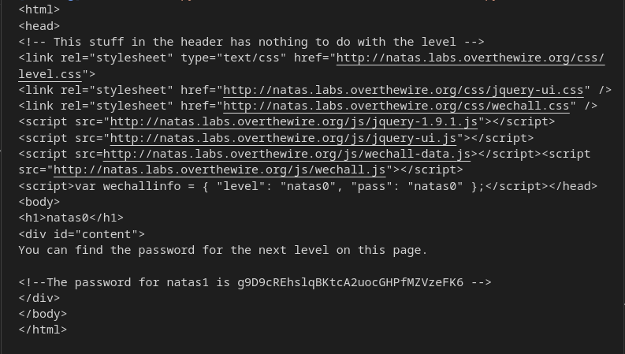

> The password for natas1 is g9D9cREhslqBKtcA2uocGHPfMZVzeFK6

## Level 1 -> Level 2
   username = natas1
```
   url = 'http://natas1.natas.labs.overthewire.org'
```
In this level, we have to see the web page source code without right-clicking. Some tricks
1. Shortcut (ctrl+U / cmd+U)
2. Setting > more tools > developer mode
3. Using python script [natas1.py]

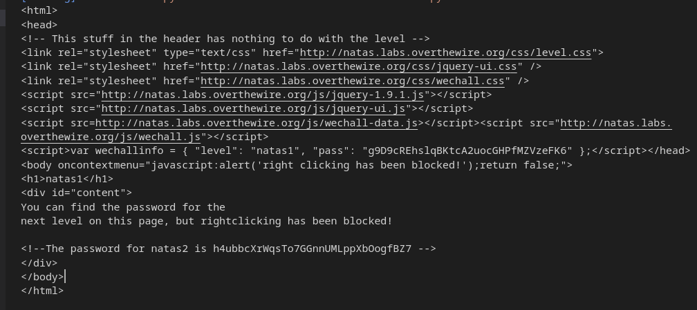

## Level 2 -> Level 3
   username = natas2
```
   url = 'http://natas2.natas.labs.overthewire.org'
```
In this level, we are given an empty web page. However, upon closer inspection we see that there is an image in the page that is 1x1 pixels in size.

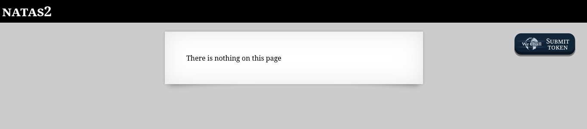
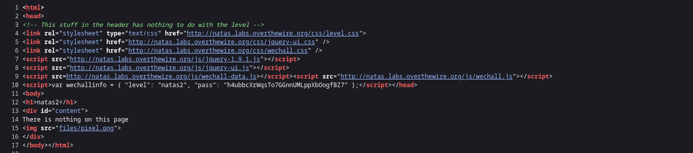
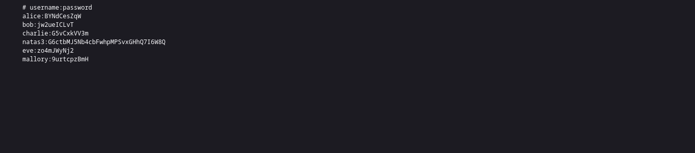

By using [natas2.py](/natas2.py) we can see password.

## Level 3-> Level 4
   username = natas3
```
   url = 'http://natas3.natas.labs.overthewire.org'
```
In this level, we look into the source of the web page and see a hint.
<!-- No more information leaks!! Not even Google will find it this time... -->
So, In my mind robots.txt triggered and I find something cool.
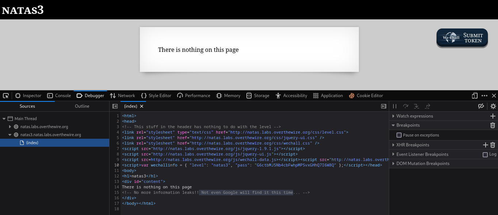

Inside http://natas3.natas.labs.overthewire.org/robots.txt
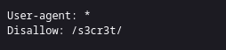
I found a directory /s3cr3t/ under this users.txt present and the password for next level is inside it.
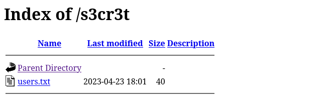
The password for next level is natas4:tKOcJIbzM4lTs8hbCmzn5Zr4434fGZQm

## Level 4 -> Level 5
   username = natas3
```
   url = 'http://natas4.natas.labs.overthewire.org'
```
On successfully logging in the natas4 webpage, we will have a message in front of us. It says “Access disallowed. You are visiting from “” while authorized users should come only from “//natas5.natas.labs.overthewire.org/” ”as shown in the figure given below.
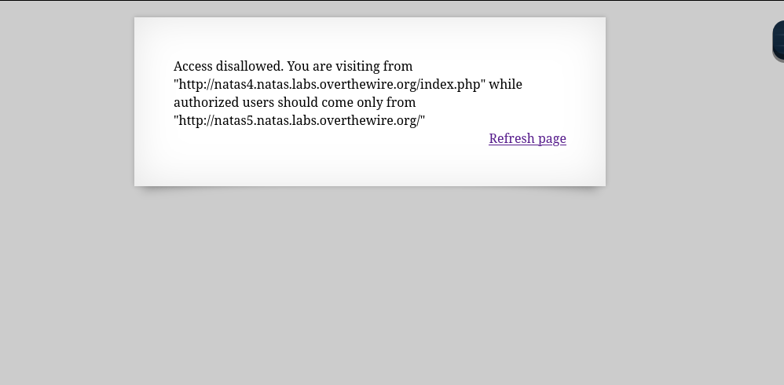

I change that Referer parameter value to Natas5 as shown in the image given below.
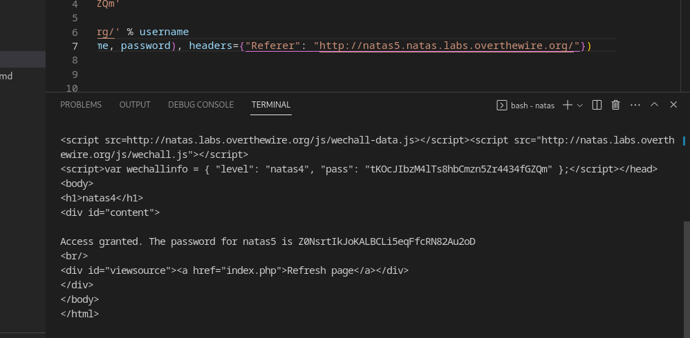

The password for natas5 is Z0NsrtIkJoKALBCLi5eqFfcRN82Au2oD

## Level 5 -> Level 6
Username: natas5
Password:  Z0NsrtIkJoKALBCLi5eqFfcRN82Au2oD
```
   url = 'http://natas5.natas.labs.overthewire.org'
```
On successfully logging in the natas5 webpage, we will have a message in front of us. It says “Access disallowed. You are not logged in” as shown in the figure given below.
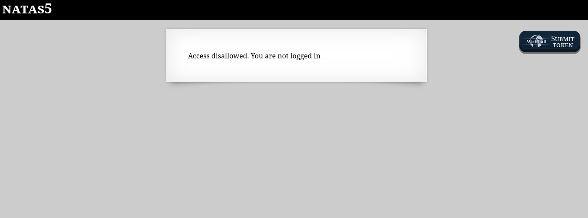
I change cookie header value loggein=1. 
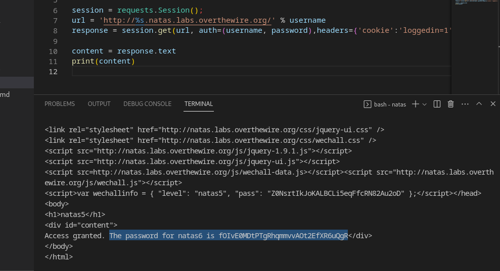 
The password for natas6 is fOIvE0MDtPTgRhqmmvvAOt2EfXR6uQgR

## Level 6 -> Level 7
Username: natas6
Password:  fOIvE0MDtPTgRhqmmvvAOt2EfXR6uQgR
```
   url = 'http://natas6.natas.labs.overthewire.org'

```
On successfully logging in the natas6 webpage, we will have a form in front of us. It says “Input secret:” as shown in the figure given below.
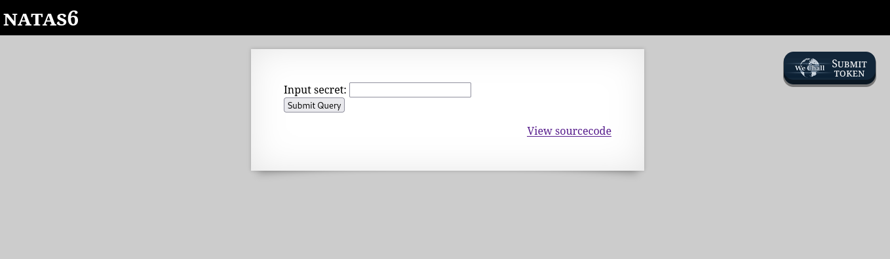
After click on view source code ther is a path includes/secret.inc
on visiting and viewing source code I found secrete there
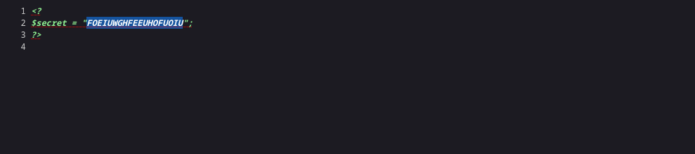
Now I copied the secret and went back to the form which was asking the secret. After entering the secret, we get the login credentials for the next level
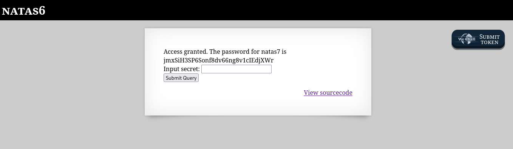
 The password for natas7 is jmxSiH3SP6Sonf8dv66ng8v1cIEdjXWr 

 ## Levle 7 -> Level 8
 username: natas7
 password: jmxSiH3SP6Sonf8dv66ng8v1cIEdjXWr 

On successfully logging in the natas7 webpage, we will have a home page in front of us. It has two pages one is home and another is about page. As show in figure below
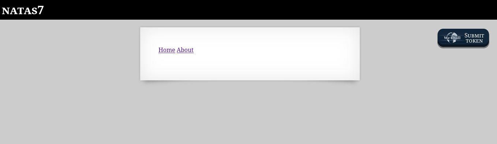
On viewing source code I got hit as shown in figure below
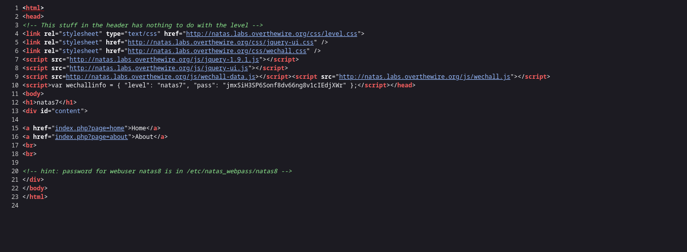
I put /etc/natas_webpass/natas8 as query in url and got password for next level.
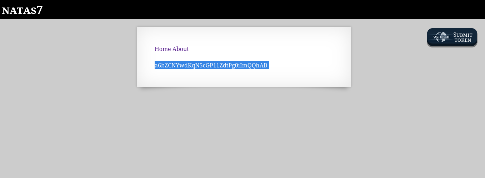

 ## Levle 8 -> Level 9
 username: natas8
 password: a6bZCNYwdKqN5cGP11ZdtPg0iImQQhAB 

On successfully logging in the natas8 webpage, we will have a form in front of us. It says “Input secret:” as shown in the figure given below.
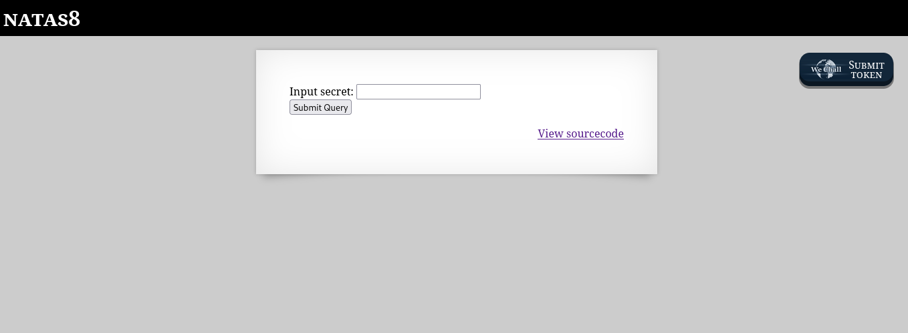
On viewing source code I got hit as shown in figure below
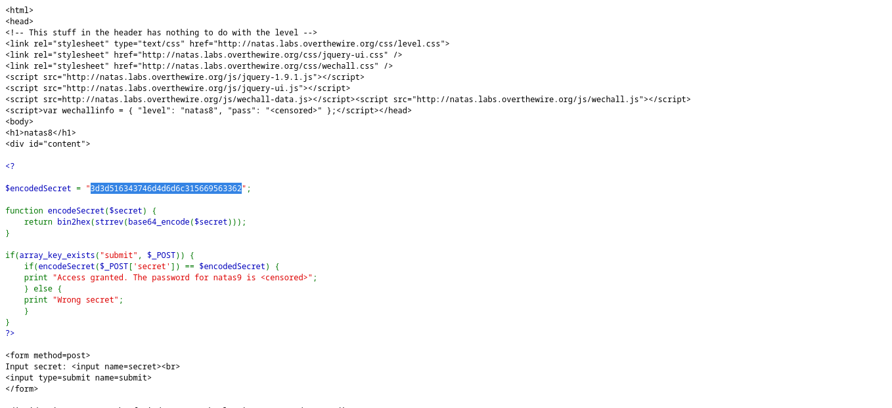
Here is give a $encodedSecret which is in hex formate.
So, I use below website to convert hex formate into text.
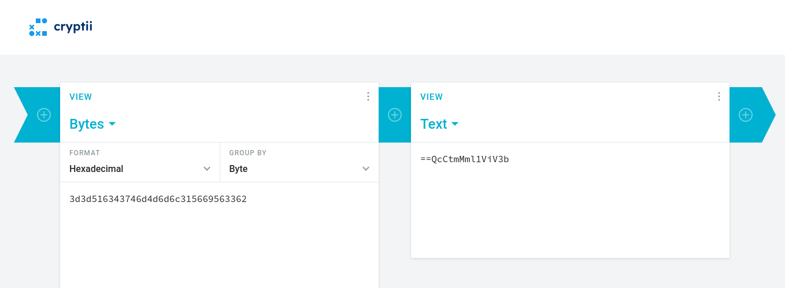
Again this text is in base64 I use below linux command to rev base64. let's decode it.
```
echo "==QcCtmMml1ViV3b" | rev | base64 -d
```
After trying this secrete we get passowrd Sda6t0vkOPkM8YeOZkAGVhFoaplvlJFd for level9.
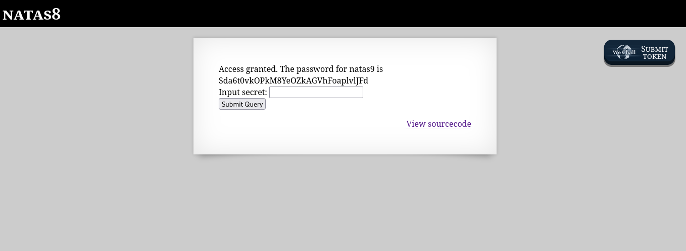

## Level 9 -> Levle 10
   usename : natas9
   password: Sda6t0vkOPkM8YeOZkAGVhFoaplvlJFd 
On successfully logging in the natas9 webpage, we will have a form in front of us. It says Find word containing:” as shown in the figure given below.
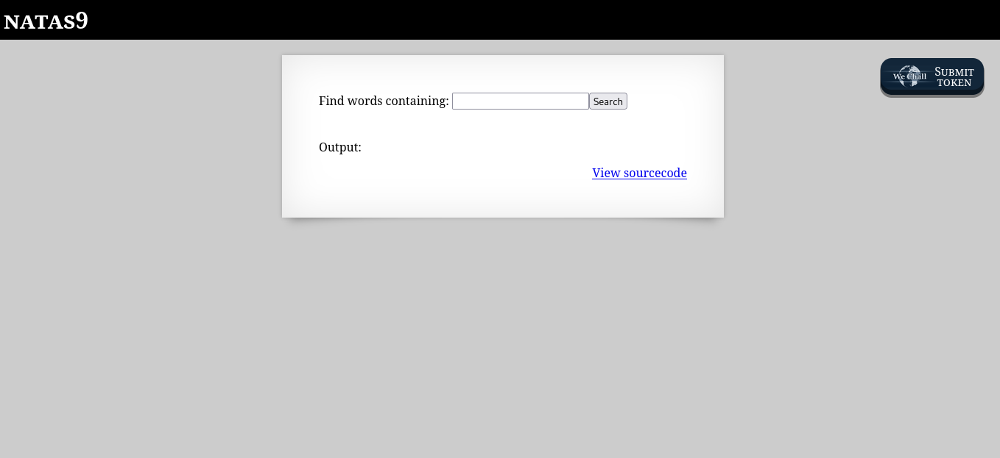

   1.	Let's click on `View sourcecode`

		<pre>
		<?
		$key = "";

		if(array_key_exists("needle", $_REQUEST)) {
			$key = $_REQUEST["needle"];
		}

		if($key != "") {
			passthru("grep -i $key dictionary.txt");
		}
		?>
		</pre>

2.	The way to call `grep` command seems to be vulnerable to commands
	injection. Let's try to set value of `needle` parameter to
	`; ls -a ;`

		dictionary.txt
	

3.	Let's try the same path suggested in Natas7. By injecting the
	following code

		; cat /etc/natas_webpass/natas10 ;
   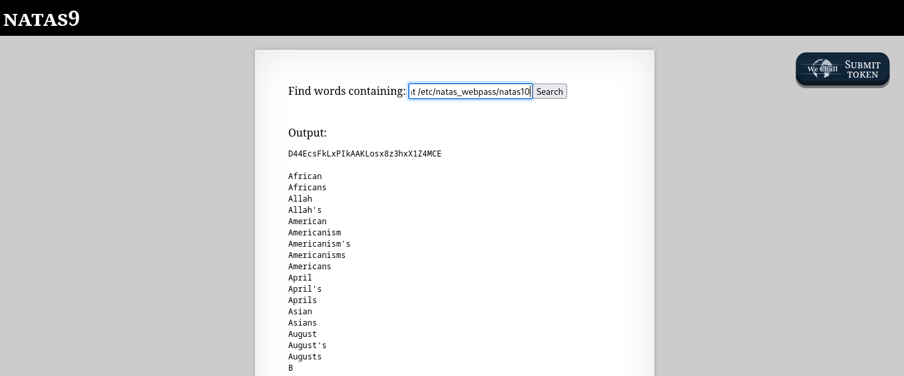

	the result is

		D44EcsFkLxPIkAAKLosx8z3hxX1Z4MCE


## Level 10 -> Levle 11
   usename : natas10
   password: D44EcsFkLxPIkAAKLosx8z3hxX1Z4MCE

On successfully logging in the natas8 webpage, we will have a form in front of us. It says Find word containing:” as shown in the figure given below

On looking source code, I get input is filtered here chars ;, & and | are not allowed.
```
<?
$key = "";

if(array_key_exists("needle", $_REQUEST)) {
    $key = $_REQUEST["needle"];
}

if($key != "") {
    if(preg_match('/[;|&]/',$key)) {
        print "Input contains an illegal character!";
    } else {
        passthru("grep -i $key dictionary.txt");
    }
}
?>
```

I am search for different payload to inject and find regular express concepts.

1. I enter "." and get all data from dictionary.txt
2. Then again enter ".*" that show me huge list
> ".* "  The .* pattern matches any character (except newline characters) zero or more times. It is a wildcard that allows for any sequence of characters.

```
Output:

.htaccess:AuthType Basic
.htaccess: AuthName "Authentication required"
.htaccess: AuthUserFile /var/www/natas/natas10/.htpasswd
.htaccess: require valid-user
.htpasswd:natas10:$apr1$LO2jk7ig$YUB5XgJmlf6cLj7G9gZHw0
dictionary.txt:African
dictionary.txt:Africans
dictionary.txt:Allah
dictionary.txt:Allah's
dictionary.txt:American
dictionary.txt:Americanism
...
```
3. As previous we found password from directory so I tried the path for next level is
> .* /etc/natas_webpass/natas11 
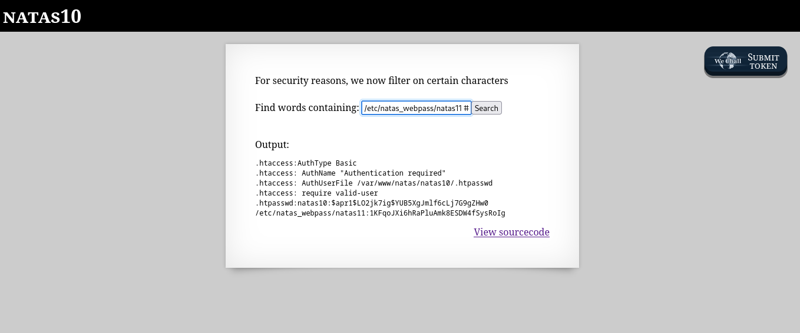

password for level11 is 1KFqoJXi6hRaPluAmk8ESDW4fSysRoIg
