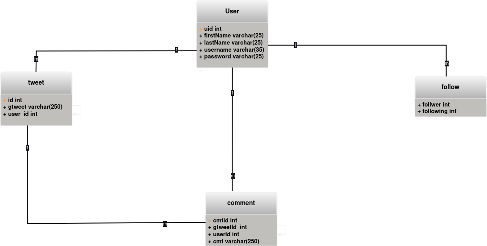
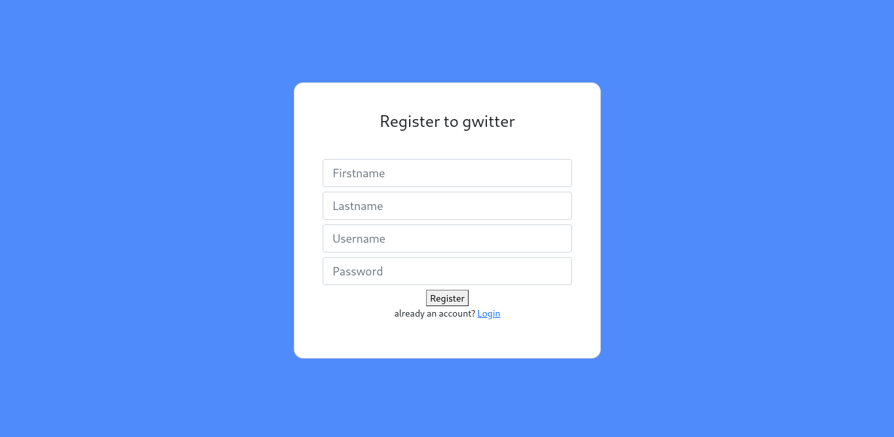
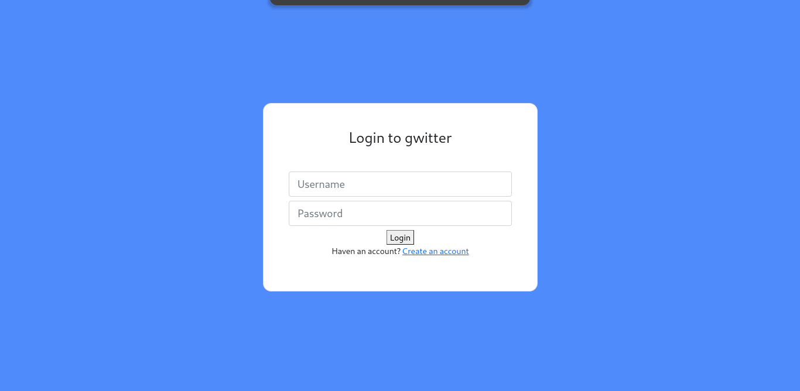
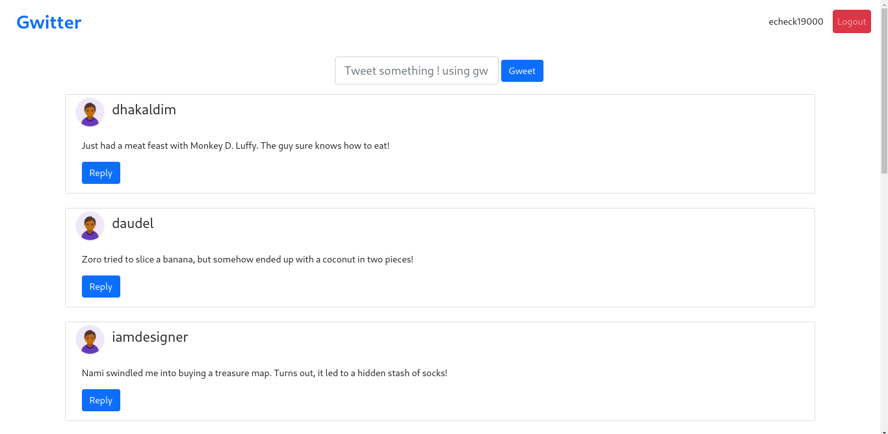
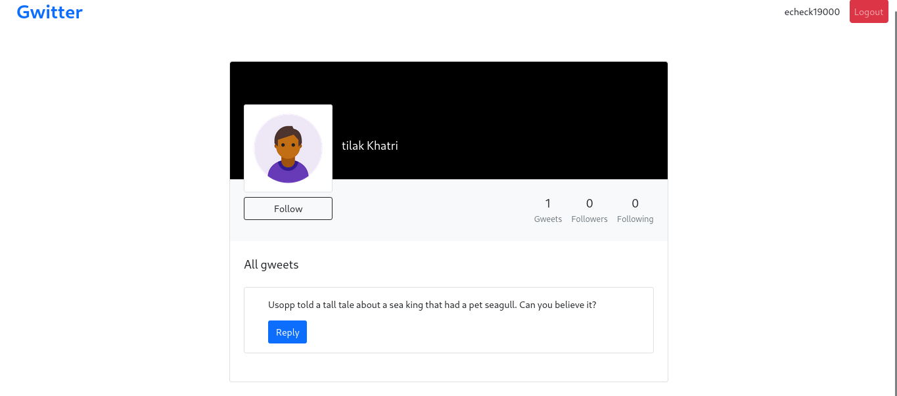

# WEEK 1

The task for Week 1 was to design database for Gwitter app using Squlite3.

The database was designed such that the user can SignUp, Login, Comment, Gweet and Follow other users.

For fulfulling the above requirements, the following tables were created in schema.sql.

### Creating Tables
We have created the following tables in schema.sql.

1. **user** : This table helps us to carry out the feature of Login and Sign up. We have the columns userid, firstName, lastName, username, password from the user in this table. 
* uid => integer and primary key
* firstname => varchar
* lastname => varchar
* username => varchar and unique
* password => varchar

2. **follow** : This table handles the feature relating to the follow. Here table has columns(id,follower,following). They are assigned the integer datatype and are autoincremented. id used as the foreign key to reference userID from users table.

3. **tweet** : This table handles the features of posting gweets. We have the columns id, gweet and userID in this table. id used as the foreign key to reference userID from user table.

4. **comments**: This table handles the features of commenting on the tweets. We have the header columns cmdID, cmt, gweetID. We have used the foreign key to reference gweetID,userId from tweet,user respectively table.

The Schema to create tables is available at tables.sql

The dummy data are available at dummydata.sql

The readme file to know about the commands to run the sql files is provided.

# Week 2:

**The task for Week 2 was to develop functionality for Gwitter**

For this I created the following files:
#### 1. [register.php](../register.php):

- Contains UI and logic for registering new user.

#### 2. [login.php](../login.php):

- Contains UI and logic for user login and session creation.

#### 3. [index.php](../index.php):

- Home page shown after successful login.
- Contains gweets posted by different users.
- Section to post new gweet.

#### 4. [profile.php](../profile.php):

- View user detail and their corresponding gweets.
- Follow and unfollow users.

#### 5. [logout.php](../logout.php):

- Logout and clear session.

# Week3

**This is an additional week to continue work on Gwitter, perhaps add a CSS framework to make it look prettier, perhaps add a feature that you think would be cool, perhaps do some bug fixes.**
- [x] Added Bootstrap stying for above components
- [X] Add Docker files
- [X] Bug fix

# Week4
**The task for this week was to test one Gwitter application and complete labs on Portswigger**

 > I am facing problem on openvas. Due to which I was not able to test gwitter with openvas.

 
For Web Security lab I did the Information Disclosure lab. The solution writeup is [here](https://www.notion.so/Information-Disclosure-706057617fa441388761f55d26ea353b?pvs=4)