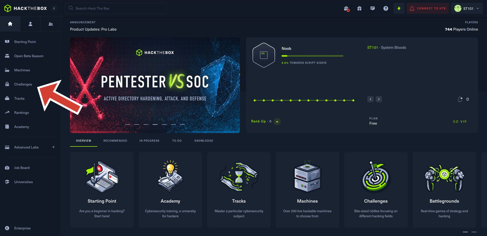
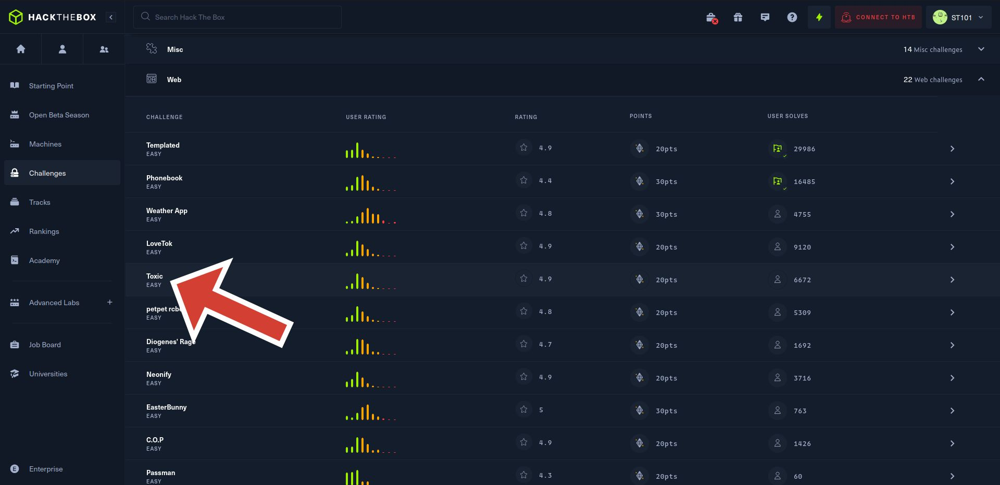
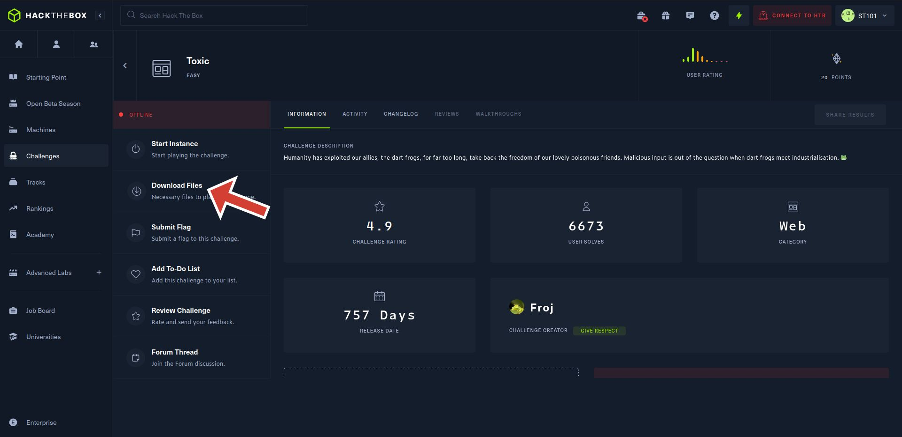
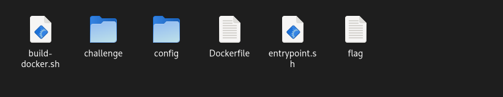

# **<u>HTB Challenge | Toxic</u>** 

## Download necessary files 

1. Go to hack the box home page: https://app.hackthebox.com/home
2. Go to the **Challenges** section 
4. From the **Active Challenges** section, select the **web** challenge named **Toxic** 
5. Download the necessary files. 

## Extract the zip file

These are the contents of the zip file after extraction. 

*Note: The zip file is password-protected. The password is provided when you click the **Download Files** option as shown in the figure above.*

## Explanation 

1. *build-docker.sh*

   `#!/bin/bash
   docker build -t web_toxic .
   docker run --name=web_toxic --rm -p1337:80 -it web_toxic`

   - The first line of the code informs the **cli interpreter** that this program is a **bash script**.

   - The second line builds a docker image (**named web_toxic**) using the Dockerfile present in the current directory.
   - The third line of the code runs the built container by mapping the port 1337 of host computer to 80 in the container. The container runs in the interactive mode and is removed automatically when it stops. 

2. *Dockerfile*

   `FROM alpine:3.13`

   `#Setup user`
   `RUN adduser -D -u 1000 -g 1000 -s /bin/sh www`

   `#Install system packages`
   `RUN apk add --no-cache --update php7-fpm supervisor nginx`

   `#Configure php-fpm and nginx`
   `COPY config/fpm.conf /etc/php7/php-fpm.d/www.conf`
   `COPY config/supervisord.conf /etc/supervisord.conf`
   `COPY config/nginx.conf /etc/nginx/nginx.conf`

   `#Copy challenge files`
   `COPY challenge /www`

   `COPY flag /flag`

   `#Setup permissions`
   `RUN chown -R www:www /var/lib/nginx`

   `#Expose the port nginx is listening on`
   `EXPOSE 80`

   `#Copy entrypoint`
   `COPY entrypoint.sh /entrypoint.sh`

   `#Start the node-js application`
   `ENTRYPOINT [ "/entrypoint.sh" ]`

   `#Populate database and start supervisord
   CMD /usr/bin/supervisord -c /etc/supervisord.conf`

   

   - Alpine linux v3.13 is used as a base image for the dockerfile. 
   - The *RUN* command is used to execute the command line instruction. So, firstly, a user is added with username **www** with default settings and then the system packages are installed using **apk** package manager.
   - The three lines of code copy the php and nginx configuration files from source to destination : *COPY src dest*.
   - The challenge file is copied to the home directory of the new user **www**. The flag file is copied to the root directory.
   - The ownership of each file (of the given path /var/lib/nginx) is assigned to the user and group **www:www** recursively.
   - Then the port on which nginx is listening to is exposed. 
   - The entrypoint.sh file is copied to the root directory. 
   - The entrypoint.sh script is executed. 
   - *CMD* command specifies the default command and arguments to be executed when running the Docker container. So, the last line of code will start **supervisord**, a process control system, with configurations mentioned in */etc/supervisord.conf* file.

3. *entrypoint.sh*

   `#!/bin/ash`

   `#Secure entrypoint
   chmod 600 /entrypoint.sh`

   `#Generate random flag filename`
   `mv /flag /flag_'cat /dev/urandom | tr -dc 'a-zA-Z0-9' | fold -w 5 | head -n 1'`

   `exec "$@"`

   - *chmod* command is used to change the permission of a file. The numeric 600 sets the permission for *entrypoint.sh* file to read and write only. 
   - In the line number 7 of the file, the commands within the backticks are executed to generate a random flag name. This random flag name is appended to the word 'flag_'. The *mv* command renames the **flag** file to **flag_RANDOMNAME**. 
   - The *exec* command in the given file executes the arguments given to the script itself. 

 ## Conclusion 

These files collectively help to build a docker image using alpine v3.13 as a base image. 