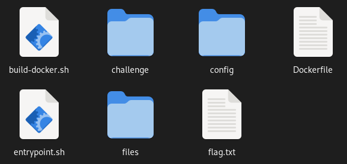
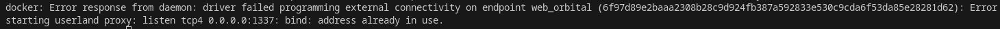
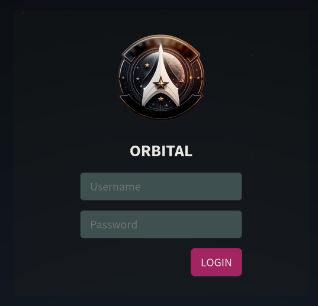

# Explanation for HTB Orbitals's docker setup

Upon downloading and extracting the assets for the HTB's Orbital challenge, we are presented with the following set of files and directories.



## 1. build-docker.sh

This is the bash script that we need to run in order to start the container running the Oribital web application. The file consists of the following commands.

```
docker rm -f web_orbital
docker build --tag=web_orbital .
docker run -p 1337:1337 -it --rm --name=web_orbital web_orbital
```

First it removes a currently running instance of the image, if any. This is necessary because the docker container needs to use port 1337, which will not be available if another container is already using it. If we try to run the script with netcat already listening on port 1337, we will get the following error.



Next, it use the `docker build` command to actually build the docker images. The command is given two arguments, a context and a `-t` flag specifying the name of the image (which is later used when running a container from the image). The context is a directory containing the set of files docker will use while building the image. It must contain at least one file, which must be named `Dockerfile`. The contents of this file will be explained later.

Finally, it uses the `docker run` command to actually run an instance of the docker image built in the last command. An instance of a dokcer image is known as a container. This command is loaded with quite a few arguments, the most important of which is the docker image to use which is provided at the end as `web_orbital` (this is same as the tag given when building the image). The container (an instance of the image) itself is also given the same name using the `--name` flag. The `--rm` flag tells docker to remove the container once it has exited. The `-it` flag is actually two different flags (`-i` and `-t` used together), and it connects stdin as the input of the process running in the container. Finally, the `-p` flag maps a port of the host system to the a port of the docker container (in this case, both are same).

## 2. Dockerfile

The Dockerfile is used by docker to build the image. It consists of a series of instructions which are explained below.
```FROM python:3.8-alpine```
The `FROM` command tells docker to start with the following base image. Since building an image from scratch is very intensive, we often start from a pre-built base image available in docker repos. In this case, we've used an image with Alpine OS having Python 3.8 installed.

```
RUN apk add --no-cache --update mariadb mariadb-client supervisor gcc musl-dev mariadb-connector-c-dev
RUN python -m pip install --upgrade pip
RUN pip install Flask flask_mysqldb pyjwt colorama
```

The `RUN` commads tells docker to run the following command in a shell. Here, three `RUN` commands are used to install the necessary packages in the image.

```
RUN mkdir -p /app
RUN mkdir -p /communication
WORKDIR /app
```
Next, we setup some a couple of directories for the app to run. The `WORKDIR` commands changes the working directory for all the following commands. In this case, the working directory is changed to `/app` from the default `/`. 

```
COPY challenge .
COPY config/supervisord.conf /etc/supervisord.conf
COPY flag.txt /signal_sleuth_firmware
COPY files /communications/
COPY --chown=root entrypoint.sh /entrypoint.sh
```

Then, the files necessary for the web application are copied to respective directories. The `COPY` instructions calculates its source path relative to the location of the Dockerfile while the destination is relative is calculated relative to the docker's working directory which was set to be `/app` by the `WORKDIR` command previously. The `--chown` flag used in the last line changes the owner of the file `entrypoint.sh` to be root.

```
EXPOSE 1337
```

The `EXPOSE` command is used to expose ports of the container. We saw in the `build-docker.sh` file that this port is mapped to a port on the host device.

```
ENV PYTHONDONTWRITEBYTECODE=1
```

This `ENV` command sets the environment variable to the provided value. In this case, it is used to disable the generation of bytecode when running python.

```
RUN chmod +x /entrypoint.sh
ENTRYPOINT ["/entrypoint.sh"]
```

By using the `RUN` command the file `entrypoint.sh` is made to be executable. This is important because in the next step it is made to be the entrypoint of the container by using `ENTRYPOINT` command.

## 3. entrypoint.sh

The entrypoint is the first thing that is executed when the container is set up. This file consists of instructions to create a backend database for the web application, the details of which are not important for this report. However, at the end of the file, the following command is run

```
/usr/bin/supervisord -c /etc/supervisord.conf
```

Recall that when the docker was built, a package called `supervisor` was installed. Supervisor is a "process control system" which, as the name suggests, is used to "monitor and control" processes on UNIX-like systems. When running the program it is provided with a configuration file which has instructions to actually run the application with the command:

```
command=python /app/run.py
```

After running the `build-docker.sh` script, we can visit `localhost:1337` and we will be greeted with the following login page.

