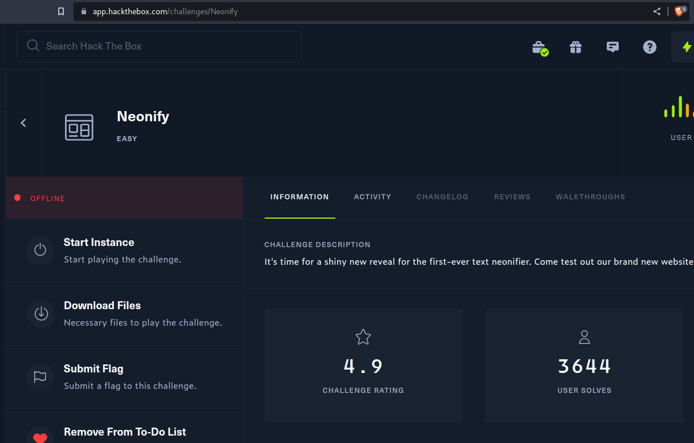
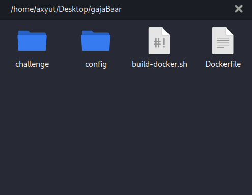
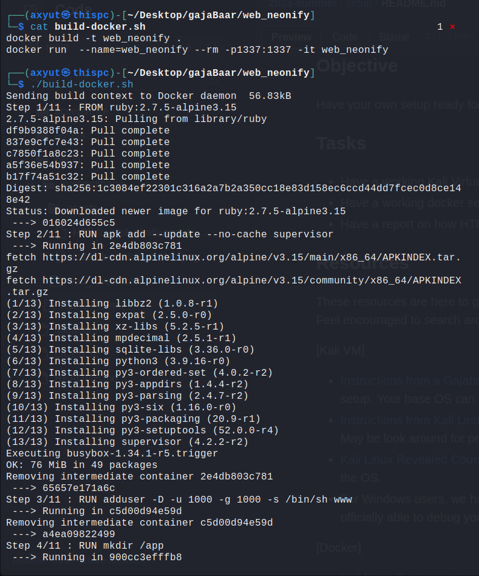
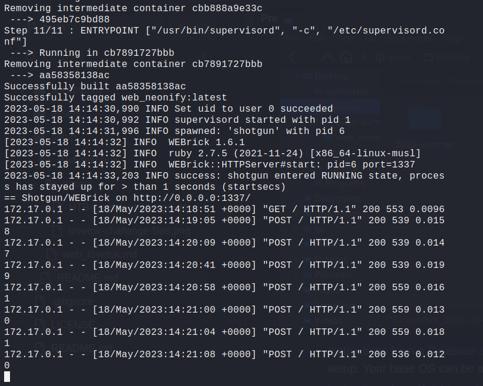

# HackTheBox Neonify

[Neonify](https://app.hackthebox.com/challenges/neonify) is a HackTheBox challenge that is fairly easy and falls under Web category thus we'll be setting it up in our local machine using docker.

## Challenge Description

It's time for a shiny new reveal for the first-ever text neonifier. Come test out our brand new website and make any text glow like a lo-fi neon tube!

## Getting Started



- Download the HTB neonify challange by clicking on the Download Files button.

- After dowloading, extract the zip file. `unzip neonify.zip` When asked, Provide with password `hackthebox`

- Navigate into the recently unzipped folder web_neonify `cd web_neonify/` and you'll see the following files.

  

## Setup

To setup the application locally we can build a docker image with `Dockerfile` but HTB has provided us `build-docker.sh` which will build the image for us and we can easily run it in our local machine.

Execute the following commands from your terminal

- `sudo ./build-docker.sh` if the file is not executable you can `sudo chmod +x build_docker.sh`



- The process will look similar to this screenshot.



- When you've seen successfully built the image, similar information will be displayed on the console, you can note the port number `port=1337` and access it from the browser at `http://localhost:1337/`

- Capture the Flag!

## Working

### build-docker.sh

The code for `build-docker.sh` is can be viewed with `cat build-docker.sh`

```
docker build -t web_neonify .
docker run  --name=web_neonify --rm -p1337:1337 -it web_neonify
```

- the docker build command uses the Dockerfile to build a new container image
- the -t flag tags your image and makes it easy for developer to interact with image
- we have named the image `web_neonify` thus we can refer to that image when we run a container.
- The `.` at the end of the docker build command tells Docker that it should look for the Dockerfile in the current directory.

- We can Start our container using the `docker run` command and specify the name of the image we just created: `--name=web_neonify`
- `--rm` is the tag that automatically removes the container after we stop the docker process with `docker stop`
- `-p1337:1337`, where -p is the tag that maps the image built port 1337 to our local port 1337, we can also change the later, to run in different port like 3000 `-p1337:3000`
- `-it` is the option to run the container in interactive mode.

This file `build-docker.sh` runs two commands for us that builds the docker image for us and serves in our local machine at port 1337.

### Dockerfile

Similarly, The code for Dockerfile is can be viewed with `cat Dockerfile` or open in your favorite text editor.

```dockerfile
FROM ruby:2.7.5-alpine3.15

# Install supervisor
RUN apk add --update --no-cache supervisor

# Setup user
RUN adduser -D -u 1000 -g 1000 -s /bin/sh www

# Copy challenge files
RUN mkdir /app
COPY challenge/ /app
COPY config/supervisord.conf /etc/supervisord.conf

# Install dependencies
WORKDIR /app
RUN bundle install
RUN gem install shotgun

# Expose the app port
EXPOSE 1337

# Start supervisord
ENTRYPOINT ["/usr/bin/supervisord", "-c", "/etc/supervisord.conf"]
```

- `FROM ruby:2.7.5-alpine3.15`
  The `FROM` instruction initializes a new build stage and sets the Base Image for subsequent instructions. Following from, image is specified, it is especially easy to start by pulling an image from the Public Repositories of DockerHub.If you omit the version, the builder assumes a latest tag by default.

- `RUN apk add --update --no-cache supervisor`
  installs the supervisor package using the apk package manager. It updates the package index, adds the package to the system, and avoids caching to reduce the image size. The supervisor package is commonly used to manage multiple processes within a containerized application.

- `RUN adduser -D -u 1000 -g 1000 -s /bin/sh www` creates a user named "www" with a specific user ID, group ID, and default shell. The -D flag indicates that no home directory should be created for the user. The -u 1000 option sets the user ID to 1000, and the -g 1000 option sets the group ID to 1000. Finally, the -s /bin/sh option sets the default shell for the user to /bin/sh.

```
RUN mkdir /app
COPY challenge/ /app
COPY config/supervisord.conf /etc/supervisord.conf
```

- These basic commands, makes a new directory `app/`, copy the files from `challenge/` to newly created `app` directory and copy config file from `config/supervisor.conf` to `/etc/supervisor.conf`

```
WORKDIR /app
RUN bundle install
RUN gem install shotgun
```

- The WORKDIR instruction sets the working directory for any RUN, CMD, ENTRYPOINT, COPY and ADD instructions that follow it in the Dockerfile. If the WORKDIR doesn’t exist, it will be created even if it’s not used in any subsequent Dockerfile instruction. Here it sets the `/app` as working directory, run the command executes commands `bundle install` and `gem install shotgun` , it is a specific command to ruby language.

- `EXPOSE 1337`
  The `EXPOSE` instruction informs Docker that the container listens on the specified network ports at runtime.

- `ENTRYPOINT ["/usr/bin/supervisord", "-c", "/etc/supervisord.conf"]`
  It is used to the default entry point for the Docker container. Syntax : `ENTRYPOINT ["executable", "param1", "param2"]`. An ENTRYPOINT allows you to configure a container that will run as an executable. When we run the Docker container build on top the image create by this `Dockerfile`then `/usr/bin/supervisord -c /etc/supervisord.conf` will be executed as the default command inside the container.
