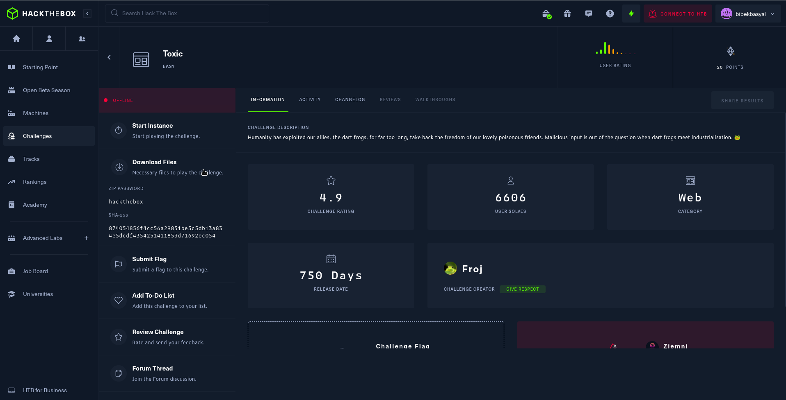
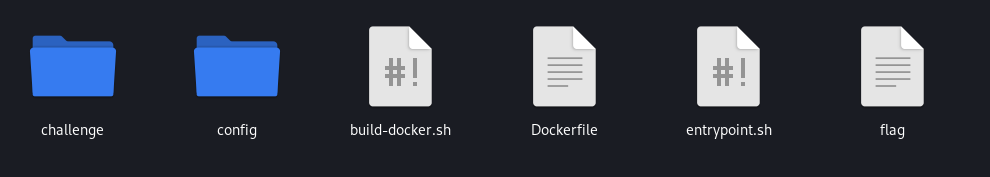
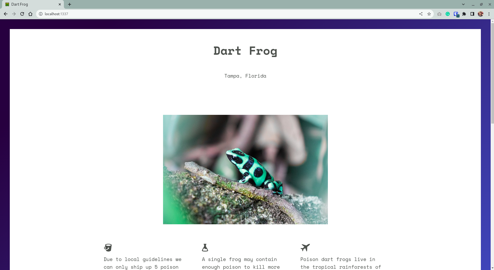

# HackTheBox `Toxic`

[Toxic](https://app.hackthebox.com/challenges/Toxic) is a HackTheBox challenge categorized as an easy web challenge. We will be setting up the challenge on our local machine using docker.

## Challenge Description

---

Humanity has exploited our allies, the dart frogs, for far too long, take back the freedom of our lovely poisonous friends. Malicious input is out of the question when dart frogs meet industrialisation. 🐸

## Getting Started

---

- To get started for the challenge we need to download the files provided in the challenge page. The files can be downloaded by clicking the download files button as shown below:



- After the files are downloaded, extract the zip file. Extracting requires password which is provided as **hackthebox**

- Extracting results a number for files and folders inside a folder named as `web_toxic/`



## Setup

---

In order to setup the application locally, we can build a docker image with `build-docker.sh` script which will build the docker image for us. This built docker image can be run in our local machine.

- To execute the script, run the following command in the terminal from the `web_toxic/` directory.

```bash
sudo ./build-docker.sh
```

- Successful execution of the script would look like:

```
Sending build context to Docker daemon  1.194MB
Step 1/13 : FROM alpine:3.13
3.13: Pulling from library/alpine
72cfd02ff4d0: Pull complete
Digest: sha256:469b6e04ee185740477efa44ed5bdd64a07bbdd6c7e5f5d169e540889597b911
Status: Downloaded newer image for alpine:3.13
 ---> 6b5c5e00213a
Step 2/13 : RUN adduser -D -u 1000 -g 1000 -s /bin/sh www
 ---> Running in 7af55c413d43
Removing intermediate container 7af55c413d43
 ---> 3538210560ae
Step 3/13 : RUN apk add --no-cache --update php7-fpm supervisor nginx
 ---> Running in a2350026a8e8
fetch https://dl-cdn.alpinelinux.org/alpine/v3.13/main/x86_64/APKINDEX.tar.gz
fetch https://dl-cdn.alpinelinux.org/alpine/v3.13/community/x86_64/APKINDEX.tar.gz
(1/26) Installing pcre (8.44-r0)
(2/26) Installing nginx (1.18.0-r15)
Executing nginx-1.18.0-r15.pre-install
Executing nginx-1.18.0-r15.post-install
(3/26) Installing php7-common (7.4.26-r0)
(4/26) Installing argon2-libs (20190702-r1)
(5/26) Installing ncurses-terminfo-base (6.2_p20210109-r1)
(6/26) Installing ncurses-libs (6.2_p20210109-r1)
(7/26) Installing libedit (20191231.3.1-r1)
(8/26) Installing pcre2 (10.36-r1)
(9/26) Installing xz-libs (5.2.5-r1)
(10/26) Installing libxml2 (2.9.14-r2)
(11/26) Installing php7-fpm (7.4.26-r0)
(12/26) Installing libbz2 (1.0.8-r1)
(13/26) Installing expat (2.2.10-r8)
(14/26) Installing libffi (3.3-r2)
(15/26) Installing gdbm (1.19-r0)
(16/26) Installing readline (8.1.0-r0)
(17/26) Installing sqlite-libs (3.34.1-r0)
(18/26) Installing python3 (3.8.15-r0)
(19/26) Installing py3-meld3 (2.0.1-r0)
(20/26) Installing py3-ordered-set (4.0.2-r0)
(21/26) Installing py3-appdirs (1.4.4-r1)
(22/26) Installing py3-parsing (2.4.7-r1)
(23/26) Installing py3-six (1.15.0-r0)
(24/26) Installing py3-packaging (20.9-r0)
(25/26) Installing py3-setuptools (51.3.3-r0)
(26/26) Installing supervisor (4.2.1-r0)
Executing busybox-1.32.1-r9.trigger
OK: 70 MiB in 40 packages
Removing intermediate container a2350026a8e8
 ---> dd1ded1350df
Step 4/13 : COPY config/fpm.conf /etc/php7/php-fpm.d/www.conf
 ---> 97ee254e0565
Step 5/13 : COPY config/supervisord.conf /etc/supervisord.conf
 ---> 539913eadbfd
Step 6/13 : COPY config/nginx.conf /etc/nginx/nginx.conf
 ---> 09a3aefa4944
Step 7/13 : COPY challenge /www
 ---> 83f6e85f6509
Step 8/13 : COPY flag /flag
 ---> abf4fd624812
Step 9/13 : RUN chown -R www:www /var/lib/nginx
 ---> Running in 9cfa661bc1f4
Removing intermediate container 9cfa661bc1f4
 ---> 832273f21362
Step 10/13 : EXPOSE 80
 ---> Running in 7edbf37a0767
Removing intermediate container 7edbf37a0767
 ---> 92541b9e74a8
Step 11/13 : COPY entrypoint.sh /entrypoint.sh
 ---> 171c77a1afa9
Step 12/13 : ENTRYPOINT [ "/entrypoint.sh" ]
 ---> Running in c32f7d6e0fcc
Removing intermediate container c32f7d6e0fcc
 ---> 9770489d6b8d
Step 13/13 : CMD /usr/bin/supervisord -c /etc/supervisord.conf
 ---> Running in 0bdc489adc86
Removing intermediate container 0bdc489adc86
 ---> 2aecbc3fee7f
Successfully built 2aecbc3fee7f
Successfully tagged web_toxic:latest
2023-05-21 12:58:42,600 INFO Set uid to user 0 succeeded
2023-05-21 12:58:42,602 INFO supervisord started with pid 1
2023-05-21 12:58:43,605 INFO spawned: 'nginx' with pid 15
2023-05-21 12:58:43,606 INFO spawned: 'fpm' with pid 16
2023/05/21 12:58:43 [notice] 15#15: using the "epoll" event method
2023/05/21 12:58:43 [notice] 15#15: nginx/1.18.0
2023/05/21 12:58:43 [notice] 15#15: OS: Linux 6.1.0-kali5-amd64
2023/05/21 12:58:43 [notice] 15#15: getrlimit(RLIMIT_NOFILE): 1048576:1048576
2023/05/21 12:58:43 [notice] 15#15: start worker processes
2023/05/21 12:58:43 [notice] 15#15: start worker process 17
[21-May-2023 12:58:43] NOTICE: fpm is running, pid 16
[21-May-2023 12:58:43] NOTICE: ready to handle connections
2023-05-21 12:58:44,620 INFO success: nginx entered RUNNING state, process has stayed up for > than 1 seconds (startsecs)
2023-05-21 12:58:44,620 INFO success: fpm entered RUNNING state, process has stayed up for > than 1 seconds (startsecs)
```

- Visiting `localhost:1337` opens up the challenge website as:



- Capture the Flag!

## Summary

---

### `build-docker.sh`

- The contents for the file can be viewed in the terminal as `cat ./build-docker.sh`

```bash
#!/bin/bash
docker build -t web_toxic .
docker run --name=web_toxic --rm -p1337:80 -it web_toxic
```

- The `docker build [OPTIONS] PATH` command is used to build a docker image in our system.

  - The `-t web_toxic` sets the built docker image with a tag name of `web_toxic` for our future reference.
  - The `.` in the end of the command refers to build the image with the files context present in current directory.

- The `docker run [OPTIONS] IMAGE [COMMANDS] [ARG...]` runs the built image as a container.
  - The `--name=web_toxic` flag assigns the container image as `web_toxic`.
  - The `--rm` flag automatically remove the container when it exits.
  - The `-it` flag is to run the docker container in an interactive mode.
  - The `p1337:80`, where -p is the tag that maps the image built port 1337 to our local port 80.

### `Dockerfile`

- The content for the Dockerfile is

```docker
FROM alpine:3.13

# Setup user
RUN adduser -D -u 1000 -g 1000 -s /bin/sh www

# Install system packages
RUN apk add --no-cache --update php7-fpm supervisor nginx

# Configure php-fpm and nginx
COPY config/fpm.conf /etc/php7/php-fpm.d/www.conf
COPY config/supervisord.conf /etc/supervisord.conf
COPY config/nginx.conf /etc/nginx/nginx.conf

# Copy challenge files
COPY challenge /www

COPY flag /flag

# Setup permissions
RUN chown -R www:www /var/lib/nginx

# Expose the port nginx is listening on
EXPOSE 80

# Copy entrypoint
COPY entrypoint.sh /entrypoint.sh

# Start the node-js application
ENTRYPOINT [ "/entrypoint.sh" ]

# Populate database and start supervisord
CMD /usr/bin/supervisord -c /etc/supervisord.conf
```

### `entrypoint.sh`

- The content for the entrypoint script file is

```bash
#!/bin/ash

# Secure entrypoint
chmod 600 /entrypoint.sh

# Generate random flag filename
mv /flag /flag_`cat /dev/urandom | tr -dc 'a-zA-Z0-9' | fold -w 5 | head -n 1`

exec "$@"
```

- `chmod 600 /entrypoint.sh` changes the permissions so that the file owner can only read and write the file.
- `mv /flag /flag_$` moves the flag file to flag\_$, where $ is a random string generated. This is basically renaming of the file.
- `exec "@"` executes the command given as arguments to the script.

These files collectively build a Docker image based on the alpine image, configure PHP-FPM and NGINX, copy challenge files and a flag into the container, set permissions, generate and rename the flag file, and define the entry point and command to run when starting the container.

This marks the successful setup of the Toxic challenge of the HTB.
