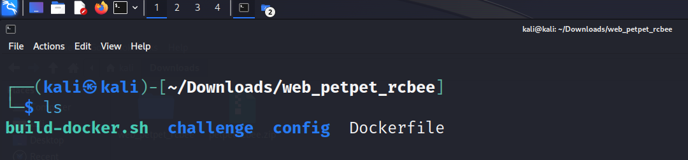
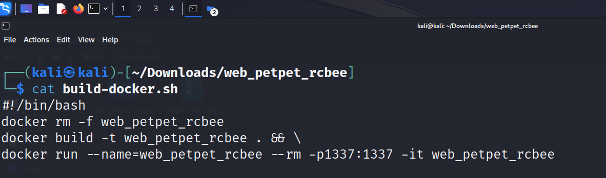
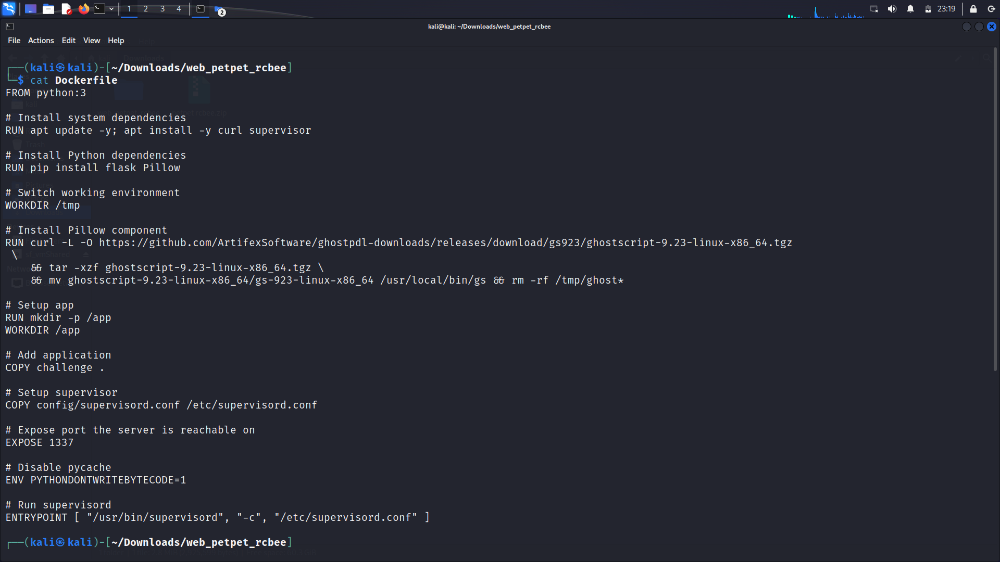
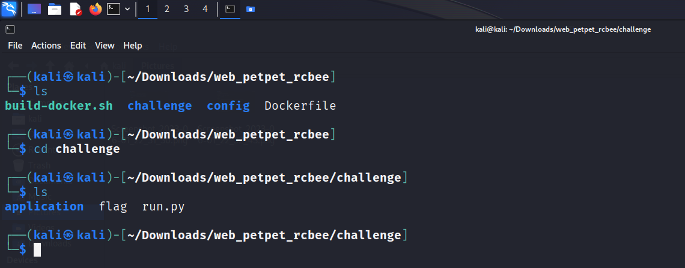
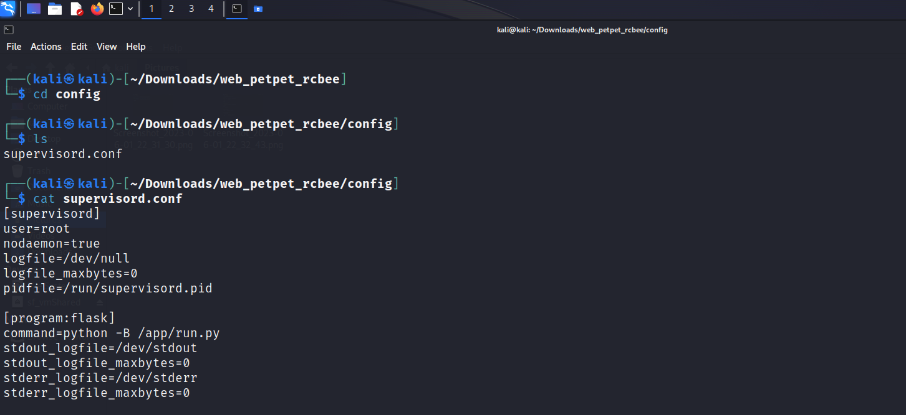
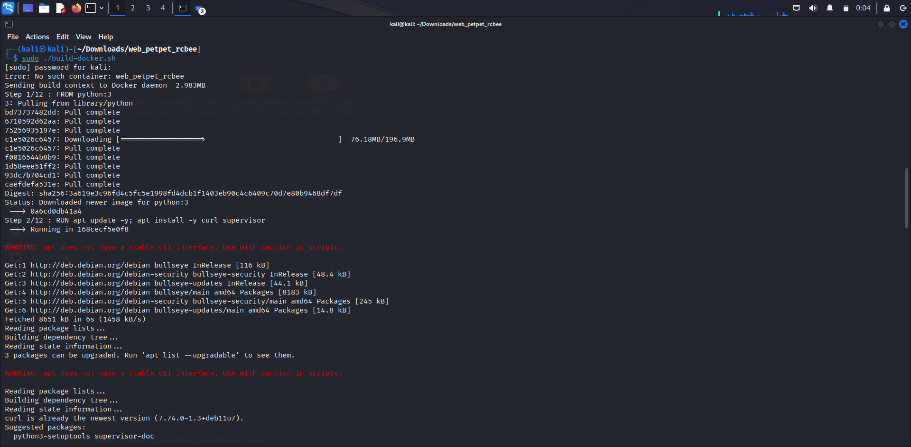
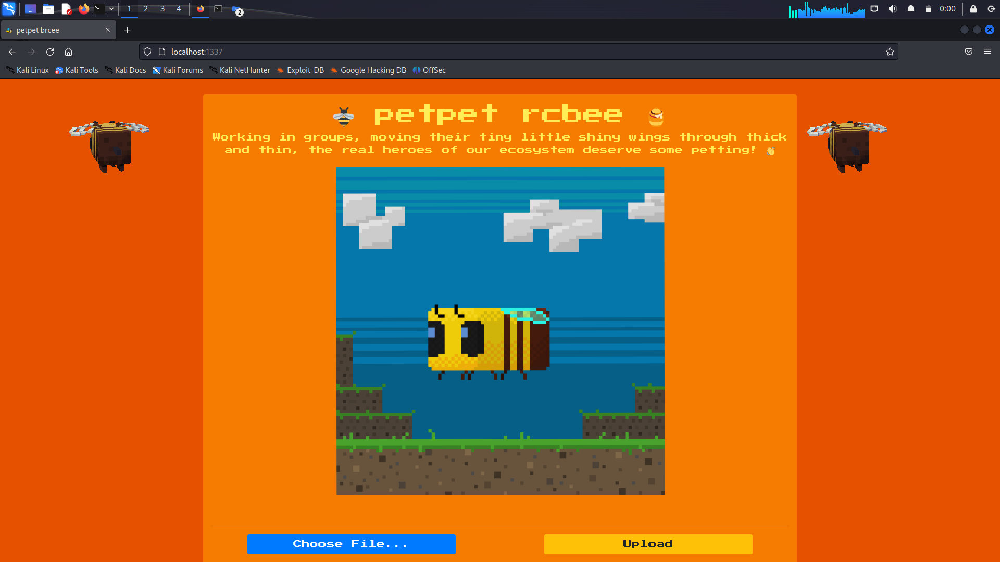

# Hack The Box | petpet rcbee

## Folder Structure:



- build-docker.sh
- challenge
- config
- Dockerfile

## Folder Breakdown

#### build-docker.sh



```http
  #!/bin/bash
```
This is called a shebang. It helps to identify that it is a bash script

```http
  docker rm -f web_petpet_rcbee
```
This removes all the existing directory with name web_petpet_rcbee to prevent collision.

```http
  docker build -t web_petpet_rcbee . && \
```
This line of code creates the docker image with name web_petpet_rcbee. Here `-t` indicates the tagName `.` indicates the current directory and `&&` is used to execute multiple lines of code in single line. Here `\` indicates that the line below to be executed.
```http
docker run --name=web_petpet_rcbee -rm -p1337:1337 -it web_petpet_rcbee
```
Here `docker run`is to run a docker & `--name=web_petpet_rcbee`is to use a container with name "web_petpet_rcbee". Here `-rm` is to delete the container file when not in use and `-p` indicates the port to be used ie when the user access the host in port 1337 it forward the request to port 1337 of container along with `-it`  for TTY access to the container with name `web_petpet_rcbee`.
### Dockerfile

```http
FROM python:3
```
This line of code specifies the base image. In our case we use `python` version 3.
```
# Install system dependencies
RUN apt update -y; apt install -y curl supervisor 
```
This line first update and install the package `curl` and `supervisor`

```
# Install Python dependencies
RUN pip install flask Pillow
```
Here we install Python dependencies `flask` and `Pillow` from `pip` library 
```
# Switch working environment
WORKDIR /tmp
```
We change the working directory to `tmp`
```

# Install Pillow component
RUN curl -L -O https://github.com/ArtifexSoftware/ghostpdl-downloads/releases/download/gs923/ghostscript-9.23-linux-x86_64.tgz \
    && tar -xzf ghostscript-9.23-linux-x86_64.tgz \
    && mv ghostscript-9.23-linux-x86_64/gs-923-linux-x86_64 /usr/local/bin/gs && rm -rf /tmp/ghost*
````
This block of code downloads the ghostscript using curl which is initially in `.tgz` then it extract using `tar -xzf` and moves the file from ` ghostscript-9.23-linux-x86_64/gs-923-linux-x86_64` into` /usr/local/bin/gs` and finallay it deletes the files and directory within `/tmp/ghost`
```
# Setup app
RUN mkdir -p /app
WORKDIR /app
```
This block of code creates the directory `app` and change working directory into `app`
```
# Add application
COPY challenge .
```
This code copies the `challenge` directory into current directory.
```
# Setup supervisor
COPY config/supervisord.conf /etc/supervisord.conf
```
This code copies `config/supervisord.conf`int `/etc/supervisord.conf`.

```
# Expose port the server is reachable on
EXPOSE 1337
```
It is the specify the port number `1337` to container

```
# Disable pycache
ENV PYTHONDONTWRITEBYTECODE=1
```
It is to set the environment variable `PYTHONDONTWRITEBYTECODE` with value `1` 
```
# Run supervisord
ENTRYPOINT [ "/usr/bin/supervisord", "-c", "/etc/supervisord.conf" ]
```
This specifies the entrypoint of container. When the container starts, `supervisord` command will execute `/etc/supervisord.conf`

### challenge

This folder contains the file and folder essential for the CTF.

### config


It contains the configuration settings for the container.

## Running Docker

firstly  we run `chmod +777 build-docker.sh` for all read, write and execute permission to "owner", "group" and "other".
Then we run `sudo ./build-docker.sh` to run the bash script.


Finally we get CTF webpage at `http://127.0.0.1:1337`.

