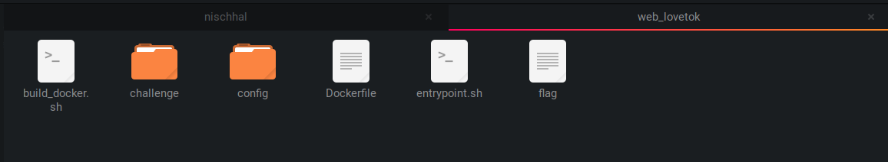
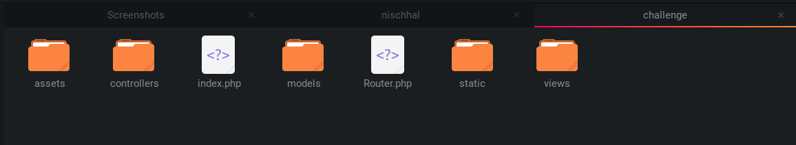
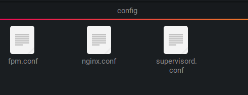

# Hack the box challenge (LOVETOK)
The challenge download file included a zip which was encrypted and it was unlocked using given password 'hackthebox'. The folder included
* build_docker.sh 
* challenge folder
* config folder
* Dockerfile
* entrypoint.sh 
* flag

The challenge can be downloaded using [this link.](https://app.hackthebox.com/challenges/lovetok)

After unzipping folder `web_lovetok/` you will be greeted with following files.


### 1. `build_docker.sh`
It included the following code.
```
#!/bin/bash
docker rm -f lovetok
docker build -t lovetok . && \
docker run --name=lovetok --rm -p1337:80 -it lovetok
```
* `#!/bin/bash`: This line specifies that the script should be interpreted using the Bash shell.

* `docker rm -f lovetok`: This command removes any existing Docker container named "lovetok". The -f option forces the removal even if the container is running.

* `docker build -t lovetok . && \`: This command builds a Docker image with the tag "lovetok" using the Dockerfile located in the current directory (.). The -t option assigns the specified tag to the image. `&& \`: The && operator is used to execute the next command (docker run) only if the previous command (docker build) succeeds. The backslash (\) is used to split the command across multiple lines for readability.

* `docker run --name=lovetok --rm -p1337:80 -it lovetok`: This command runs a Docker container using the "lovetok" image. Let's break down the options:


### 2.`challenge/`
It includes the source code for the Website that will be provided for us to pentest.


### 3. `config/`
It has all the config file for the PHP-FPM, Nginx, and Supervisord components of the LoveTok web application.


* `fpm.conf`: It contains configuration directives for PHP-FPM's behavior and settings.
* `nginx.conf`: It contains the main configuration file for the Nginx web server, and it typically includes various directives that control Nginx's behavior.
* `supervisord.conf`: The supervisord.conf file is the main configuration file for Supervisor, a process control system for Unix-like systems. The supervisord.conf file defines how Supervisor manages and monitors various processes on your system.

### 4.`Dockerfile`
It contains a set of instructions used to build a Docker image. It provides a recipe or a blueprint for creating a containerized environment. When you run the docker build command with the Dockerfile as input, Docker reads the instructions and executes them sequentially to construct the image.
Upon further inspection it contained the following code:
```
FROM debian:buster-slim

# Setup user
RUN useradd www

# Install system packeges
RUN apt-get update && apt-get install -y supervisor nginx lsb-release wget

# Add repos
RUN wget -O /etc/apt/trusted.gpg.d/php.gpg https://packages.sury.org/php/apt.gpg
RUN echo "deb https://packages.sury.org/php/ $(lsb_release -sc) main" | tee /etc/apt/sources.list.d/php.list

# Install PHP dependencies
RUN apt update && apt install -y php7.4-fpm

# Configure php-fpm and nginx
COPY config/fpm.conf /etc/php/7.4/fpm/php-fpm.conf
COPY config/supervisord.conf /etc/supervisord.conf
COPY config/nginx.conf /etc/nginx/nginx.conf

# Copy challenge files
COPY challenge /www

# Copy flag
COPY flag /

# Setup permissions
RUN chown -R www:www /www /var/lib/nginx

# Expose the port nginx is listening on
EXPOSE 80

# Generate random flag filename and start supervisord
COPY --chown=root entrypoint.sh /entrypoint.sh
ENTRYPOINT ["/entrypoint.sh"]

CMD ["/usr/bin/supervisord", "-c", "/etc/supervisord.conf"]
```
#### Explaination
* `FROM debian:buster-slim`: This line specifies the base image for your Docker image. In this case, it uses the Debian Buster Slim image as the starting point.

* `RUN useradd www`: This command creates a new user named "www" within the Docker image.

* `RUN apt-get update && apt-get install -y supervisor nginx lsb-release wget`: This line updates the package repositories and installs the following packages inside the Docker image: Supervisor, Nginx, lsb-release, and wget.

* `RUN wget -O /etc/apt/trusted.gpg.d/php.gpg https://packages.sury.org/php/apt.gpg`: This command retrieves the GPG key required for adding the PHP repository.

* `RUN echo "deb https://packages.sury.org/php/ $(lsb_release -sc) main" | tee /etc/apt/sources.list.d/php.list`: This line adds the PHP repository to the package sources list using the tee command.

* `RUN apt update && apt install -y php7.4-fpm`: This command updates the package repositories again and installs PHP 7.4 FPM (FastCGI Process Manager) package.

* `COPY config/fpm.conf /etc/php/7.4/fpm/php-fpm.conf`: This line copies the fpm.conf file from the local config directory to the /etc/php/7.4/fpm/ directory inside the Docker image. It is used to configure PHP-FPM.

* `COPY config/supervisord.conf /etc/supervisord.conf`: This line copies the supervisord.conf file from the local config directory to the /etc/ directory inside the Docker image. It is used to configure Supervisor, the process control system.

* `COPY config/nginx.conf /etc/nginx/nginx.conf`: This line copies the nginx.conf file from the local config directory to the /etc/nginx/ directory inside the Docker image. It is used to configure Nginx, the web server.

* `COPY challenge /www`: This line copies the contents of the challenge directory from the local context to the /www directory inside the Docker image. It likely includes the files required for your application.

* `COPY flag /`: This line copies the flag file from the local context to the root directory (/) inside the Docker image. The purpose of this file may vary depending on the application or challenge being built.

* `RUN chown -R www:www /www /var/lib/nginx`: This command changes the ownership of the /www and /var/lib/nginx directories to the user and group "www" created earlier.

* `EXPOSE 80`: This line specifies that the Docker container will listen on port 80, allowing incoming connections to the Nginx web server.

* `COPY --chown=root entrypoint.sh /entrypoint.sh`: This line copies the entrypoint.sh script to the root directory (/) inside the Docker image and sets the ownership to the root user.

* `ENTRYPOINT ["/entrypoint.sh"]`: This line specifies the entry point command for the Docker container, which is the entrypoint.sh script. It will be executed when the container starts.

* `CMD ["/usr/bin/supervisord", "-c", "/etc/supervisord.conf"]`: This line specifies the default command to run when the container starts if no other command is provided. It runs Supervisor with the specified configuration file.

### 5.`entrypoint.sh`
```
#!/bin/bash

# Secure entrypoint
chmod 600 /entrypoint.sh

FLAG=$(cat /dev/urandom | tr -dc 'a-zA-Z0-9' | fold -w 5 | head -n 1)

mv /flag /flag$FLAG

exec "$@"
```
The provided code is a bash script that serves as the entrypoint for a Docker container. Let's go through each line and explain its purpose:

* `chmod 600 /entrypoint.sh`: This line sets the file permissions of the entrypoint.sh script to read and write for the owner only (600). This is a security measure to restrict access to the script.

* `FLAG=$(cat /dev/urandom | tr -dc 'a-zA-Z0-9' | fold -w 5 | head -n 1)`: This line generates a random string of 5 alphanumeric characters and assigns it to the FLAG variable. It uses the /dev/urandom device file to obtain random data, filters out non-alphanumeric characters using tr, and selects the first 5 characters using fold and head commands.

* `mv /flag /flag$FLAG`: This line renames the file /flag to /flag$FLAG, where $FLAG is the random string generated in the previous line. It effectively appends the random string to the original filename.

* `exec "$@"`: This line executes the command-line arguments passed to the entrypoint script. The "$@" expands to all the arguments provided when running the container. This allows you to specify different commands or scripts to run within the container at runtime.

### 6. `flag`
 It provides the flag for testing which changes randomly due as commanded by the programs above.

 Overall, the details provided include a Dockerfile and a Bash script used in the context of a web application deployment. The Dockerfile sets up a Docker image based on Debian Buster, installing system packages like Supervisor, Nginx, and PHP 7.4 FPM, configuring them, and copying necessary files. The Bash script serves as the entrypoint for the Docker container, securing the entrypoint script, renaming the flag file with a random string, and executing the provided command or entrypoint. These components work together to create a containerized environment for running the web application in order to allow us to test it.