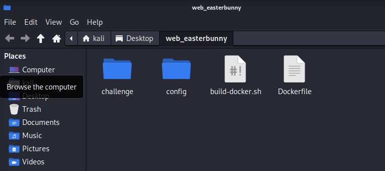
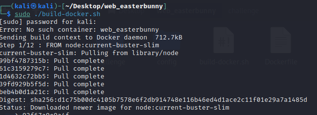

# HackTheBox EasterBunny
To setup the web_easterbunny challange, first of all the zip file needs to be downloaded from the HackTheBox website using [this link](https://app.hackthebox.com/challenges/easterbunny).

# Challenge Description
It's that time of the year again! Write a letter to the Easter bunny and make your wish come true! But be careful what you wish for because the Easter bunny's helpers are watching!


# Folder Structure
Upon extracting the the zip file downloaded, folder structure containing following files and folders can be observed:
Challenge Folder: The challenge folder is the primary directory that houses all of the challenge-related files and materials. The challenge materials are stored and organized in it as the challenge's root directory.



**Source Code Folder**: The source code folder normally contains the application's source code files. The scripts, programming code, and other files required to create and execute the application may be found in this folder. In order to complete the challenge, participants frequently spend time studying, changing, or troubleshooting the source code.

**Config Folder**: The configuration folder typically houses the configuration files necessary for the settings and operation of the application. These files might include any settings that the program needs, such as environment-specific configurations, database connection settings, security configurations, or other settings.To fully grasp or take advantage of some features of the challenge, participants might need to inspect or alter these configuration files.

**build_docker.sh**: The build_docker.sh file contains a shell script that automates the creation of the application's Docker image. Usually, it contains directions or commands to create the Docker image using the supplied Dockerfile and any other dependencies or settings required. Participants can use this script to make the Docker application environment setup procedure simpler.

`!/bin/bash1`:

This line is known as a shebang and specifies the interpreter that should be used to execute the subsequent commands in the script, in this case, it specifies that the commands should be interpreted by the Bash shell.


`docker rm -f web_easterbunny`:

This command removes (deletes) any existing Docker container named "web_easterbunny." The -f flag forces the removal, even if the container is running.

`docker build --tag=web_easterbunny` .:

This command builds a Docker image from the current directory (.) using the instructions specified in the Dockerfile. The --tag option assigns a tag or name to the resulting image, in this case, "web_easterbunny." The image is built based on the configuration defined in the Dockerfile.

`docker run -p 1337:80 -it --name=web_easterbunny web_easterbunny`:

This command runs a Docker container based on the "web_easterbunny" image. It maps port 1337 of the host machine to port 80 of the container (-p 1337:80). The -it flags allocate a pseudo-TTY and keep STDIN open, allowing interaction with the container's command line. The --name option assigns a name to the running container, also set as "web_easterbunny."
These commands, when executed in order, remove any existing container, build a new Docker image, and then run a new container based on that image. The container is accessible via port 1337 on the host machine, with any interaction occurring through the command line interface of the container.

**Dockerfile**: A text file called the Dockerfile includes a set of instructions for creating a Docker image. It details the base image, the necessary dependencies, configuration options, and other actions required to establish an environment that is self-contained and repeatable for the application.Participants can utilize the image created by Docker using the Dockerfile to execute the application as a container. To tailor the container environment or take advantage of vulnerabilities connected to containerization, participants may need to comprehend and change the Dockerfile.

```
FROM node:current-buster-slim

# Install Chrome
RUN apt update \
    && apt install -y wget gnupg \
    && wget -q -O - https://dl-ssl.google.com/linux/linux_signing_key.pub | apt-key add - \
    && sh -c 'echo "deb [arch=amd64] http://dl.google.com/linux/chrome/deb/ stable main" >> /etc/apt/sources.list.d/google.list' \
    && apt update \
    && apt install -y google-chrome-stable fonts-ipafont-gothic fonts-wqy-zenhei fonts-thai-tlwg fonts-kacst fonts-freefont-ttf libxss1 libxshmfence-dev \
    --no-install-recommends \
    && rm -rf /var/lib/apt/lists/*

# Install varnish & supervisord
RUN apt update \
    && wget -q -O - https://packagecloud.io/varnishcache/varnish60lts/gpgkey | apt-key add - \
    && sh -c 'echo "deb https://packagecloud.io/varnishcache/varnish60lts/debian/ buster main" >> /etc/apt/sources.list.d/varnishcache_varnish60lts.list' \
    && apt update \
    && apt install -y varnish apt-transport-https supervisor \
    && rm -rf /var/lib/apt/lists/*

RUN dd if=/dev/urandom of=/etc/varnish/secret count=1

# Setup varnish and supervisord
COPY ./config/cache.vcl /etc/varnish/default.vcl
COPY ./config/supervisord.conf /etc/supervisor/supervisord.conf

# Setup app
RUN mkdir -p /app

# Add application
WORKDIR /app
COPY --chown=www-data:www-data challenge .

# Install dependencies
RUN yarn

# Expose the port application is reachable on
EXPOSE 80

# Start supervisord
CMD ["/usr/bin/supervisord", "-c", "/etc/supervisor/supervisord.conf"]
```
The challenge is run by executing the following set of commands after launching the terminal inside the directory with `Dockerfile`:
```
sudo chmod +x docker-build.sh
sudo ./docker-build.sh
```

It is essential for participants to comprehend the purpose of each file and folder in order to properly set up and engage with the challenge. The task may be successfully completed by looking at the source code, investigating the configuration, creating the Docker image using the Dockerfile, and running the application.


