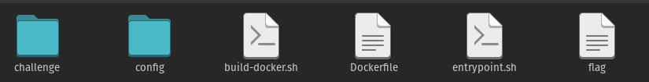

# Setting Up the HackTheBox Challenge: Toxic Using Docker

## Toxic Challenge

We are provided with some downloadable files in this challenge. After downloading the given files, we extract the zip file after using the given password "hackthebox".
Once, the files are extracted or unzipped, we can see the folders/files: challenge, config, build_docker.sh, Dockerfile, entrypoint.sh and flag. Here are brief description of what every file/folder contains and what role does it play helping us to run the challenge in the docker.



### 1. Challenge


 ```challenge/``` folder has source codes including required images as assets which we will be pentesting to solve the challenge.

### 2. Build docker.sh
 ```build-docker.sh/``` is a bash script that builds dockerfile in current directory and then runs a container from that image.

```
#!/bin/bash
docker build -t web_toxic .
docker run --name=web_toxic --rm -p1337:80 -it web_toxic
```

- ```docker build -t web_toxic .``` This command builds a Docker image using the Dockerfile in the current directory (.) and tags it with the name web_toxic. The -t option specifies the tag name for the image.

- ```docker run --name=web_toxic --rm -p1337:80 -it web_toxic``` The docker run command launches a container named "web_toxic" based on the "web_toxic" image. The container is automatically removed when it stops. Port 1337 on the host is mapped to port 80 inside the container for accessing the web application. Interactive mode with a pseudo-TTY is enabled.


### 3. Config


 ```config directory``` has the config files for Nginx, FPM and the components needed for the Toxic webapp. A config file is a file used to configure the parameters and initial settings for some computer programs. 

#### i) fpm.conf
- In ```fpm.conf```, we have FPM(FastCGI Process Manager) configuration file. This file manages and processes PHP requests for web server Nginx.
```
[global]
daemonize = no
error_log = /dev/stderr
log_level = notice

[www]
user = www
group = www

clear_env = On

listen = /run/php-fpm.sock
listen.owner = www
listen.group = www

pm = dynamic
pm.max_children = 5
pm.start_servers = 2
pm.min_spare_servers = 1
pm.max_spare_servers = 3
```
In the [global] section, the configuration options are specified for the global PHP-FPM settings.

`daemonize` is set to no, which means PHP-FPM will run in the foreground instead of running as background process.

`error_log` is set to /dev/stderr, indicating that error logs should be written to the standard error output.

`log_level` is set to notice, which determines the verbosity level for logging messages.

`user` and `group` specify the system user and group under which PHP-FPM processes will run. In this case, both are set to www.

`clear_env` is set to On, indicating that the environment variables of PHP-FPM workers should be cleared.

`listen` specifies the socket or IP address on which PHP-FPM will listen for incoming connections. In this case, it is set to /run/php-fpm.sock.
listen.owner and listen.group specify the owner and group of the socket.
pm stands for process manager, and dynamic means that the number of PHP-FPM processes will be dynamically adjusted based on the workload.

`pm.max_children` defines the maximum number of child processes that PHP-FPM can create for handling requests which is set to 5 here in this challenge. 

`pm.start_servers` indicates the number of child processes to start initially when PHP-FPM starts or restarts.

`pm.min_spare_servers` defines the minimum number of idle child processes that should be available to handle incoming requests.

`pm.max_spare_servers` specifies the maximum number of idle child processes that can be kept alive to handle future requests.

#### ii) nginx.conf
- In ```nginx.conf```, we have a code snippet of Nginx configuration file.
```
user www;
pid /run/nginx.pid;
error_log /dev/stderr info;

events {
    worker_connections 1024;
}

http {
    server_tokens off;
    log_format docker '$remote_addr $remote_user $status "$request" "$http_referer" "$http_user_agent" ';
    access_log /var/log/nginx/access.log docker;

    charset utf-8;
    keepalive_timeout 20s;
    sendfile on;
    tcp_nopush on;
    client_max_body_size 1M;

    include  /etc/nginx/mime.types;

    server {
        listen 80;
        server_name _;

        index index.php;
        root /www;

        location / {
            try_files $uri $uri/ /index.php?$query_string;
            location ~ \.php$ {
                try_files $uri =404;
                fastcgi_pass unix:/run/php-fpm.sock;
                fastcgi_index index.php;
                fastcgi_param SCRIPT_FILENAME $document_root$fastcgi_script_name;
                include fastcgi_params;
            }
        }
    }
}
```
This code configures Nginx as an HTTP server to handle requests and serve PHP files. It sets the user and process ID, defines error logging, worker connections, global server settings, access logging format, character encoding, timeout values, file handling options, and MIME types. It establishes a server block that listens on port 80, sets the default file and root directory, and defines request handling rules for serving PHP files via PHP-FPM.

#### iii) supervisord.conf

- In ```supervisord.conf```, we have code snippet for process control system used to manage and monitor processes on Unix-like systems: 
```
[supervisord]
user=root
nodaemon=true
logfile=/dev/null
logfile_maxbytes=0
pidfile=/run/supervisord.pid

[program:fpm]
command=php-fpm7 -F
autostart=true
priority=1000
stdout_logfile=/dev/stdout
stdout_logfile_maxbytes=0
stderr_logfile=/dev/stderr
stderr_logfile_maxbytes=0

[program:nginx]
command=nginx -g 'daemon off;'
autostart=true
stdout_logfile=/dev/stdout
stdout_logfile_maxbytes=0
stderr_logfile=/dev/stderr
stderr_logfile_maxbytes=0
```
The Supervisord configuration specifies that it should run as the root user, in a non-daemon mode, with logging disabled. It sets the PID file location.

The "fpm" program is configured to execute the command php-fpm7 -F to start PHP-FPM. It is set to autostart, has a high priority, and its standard output and error are redirected to /dev/stdout and /dev/stderr, respectively.

The "nginx" program is configured to execute the command nginx -g 'daemon off;' to start Nginx. It is also set to autostart, and its standard output and error are redirected to /dev/stdout and /dev/stderr, respectively.

Overall, this configuration allows Supervisord to manage the execution of PHP-FPM and Nginx, ensuring their proper startup, monitoring, and logging.


### 4. Dockerfile
 ```Dockerfile``` outlines the steps to build a Docker image for the Toxic web app.

 ```
 FROM alpine:3.13

# Setup user
RUN adduser -D -u 1000 -g 1000 -s /bin/sh www

# Install system packages
RUN apk add --no-cache --update php7-fpm supervisor nginx

# Configure php-fpm and nginx
COPY config/fpm.conf /etc/php7/php-fpm.d/www.conf
COPY config/supervisord.conf /etc/supervisord.conf
COPY config/nginx.conf /etc/nginx/nginx.conf

# Copy challenge files
COPY challenge /www

COPY flag /flag

# Setup permissions
RUN chown -R www:www /var/lib/nginx

# Expose the port nginx is listening on
EXPOSE 80

# Copy entrypoint
COPY entrypoint.sh /entrypoint.sh

# Start the node-js application
ENTRYPOINT [ "/entrypoint.sh" ]

# Populate database and start supervisord
CMD /usr/bin/supervisord -c /etc/supervisord.conf
 ```

- ```FROM alpine:3.13``` This line sets the base image as Alpine Linux version 3.13.

- ```RUN adduser -D -u 1000 -g 1000 -s /bin/sh www``` Here it creates a user named "www" with a specific user ID and group ID.

- ```RUN apk add --no-cache --update php7-fpm supervisor nginx``` This command installs PHP-FPM, Supervisor, and Nginx packages using the Alpine package manager (apk).

- ```COPY config/fpm.conf /etc/php7/php-fpm.d/www.conf``` It copies the "fpm.conf" file from the local directory "config" to the container's "/etc/php7/php-fpm.d/www.conf" path.

- ```COPY config/supervisord.conf /etc/supervisord.conf``` It copies the "supervisord.conf" file to the container's "/etc/supervisord.conf" path.

- ```COPY config/nginx.conf /etc/nginx/nginx.conf``` It copies the "nginx.conf" file to the container's "/etc/nginx/nginx.conf" path.

- ```COPY challenge /www``` This copies the "challenge" directory (presumably containing web application files) to the "/www" directory in the container.

- ```COPY flag /flag``` It copies a "flag" file to the "/flag" path in the container.

- ```RUN chown -R www:www /var/lib/nginx``` Here, it changes the ownership of the "/var/lib/nginx" directory to the "www" user and group.

- ```EXPOSE 80``` This exposes port 80 to allow incoming connections to the container.

- ```COPY entrypoint.sh /entrypoint.sh``` It copies the "entrypoint.sh" script to the container's root directory.

- ```ENTRYPOINT [ "/entrypoint.sh" ]``` This sets the entrypoint for the container to execute the "entrypoint.sh" script.

- ```CMD /usr/bin/supervisord -c /etc/supervisord.conf``` This specifies the default command to run when the container starts. It starts Supervisord and passes the "supervisord.conf" configuration file.


At the end, we opened the *build-docker.sh* file in docker container & viewed the challenge through http://localhost:1337 .