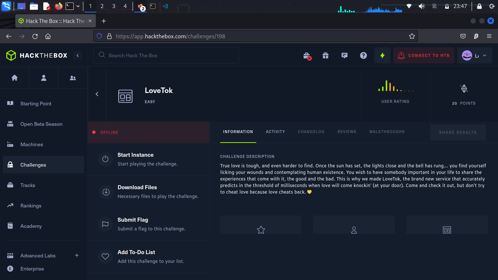
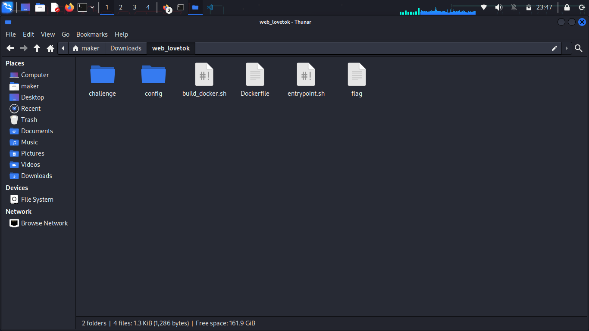
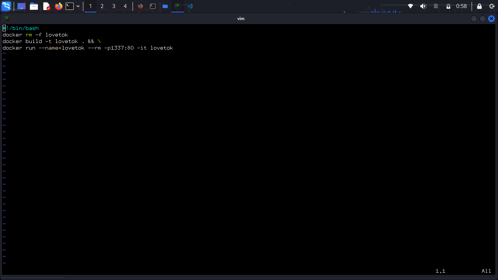
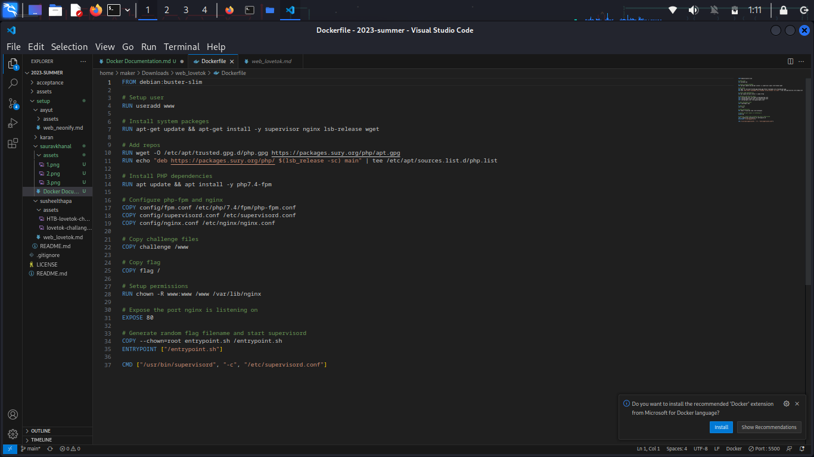
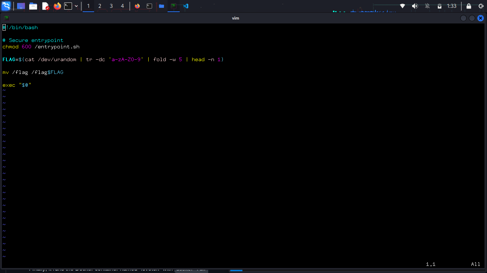

# Hack The Box Challange | `lovetok`

Let's talk about the files found in the Hack The Box challenges.
Before we delve into the explanation of those files, 
let's proceed with the download of the challenge files that we will be discussing.

### Lets Download the `web_lovetok` HTB challange file in your system

- Log into your account or if you don't have a account create a account on [click here](https://app.hackthebox.com)

- Download the HTB lovetok challange [click here](https://app.hackthebox.com/challenges/lovetok)
 
 

- When you dowload the file, extract the zip file. _enter password which is `**hackthebox**`_
When you open the folder `web_lovetok/` you will see following six files.

- `build_docker.sh`
- `entrypoint.sh`
- `Dockerfile`
- `challange`(folder)
- `config`(folder)
- `flag`


Today, We will be discussing the `build_docker.sh`, `Dockerfile` and `entrypoint.sh` .

### Explaination of three files

#### Build_docker.sh


<details>
<summary>Explaination of build_docker,sh</summary>

Let's analyze the program and discuss each line of code:
- `#!/bin/bash`

This line indicates that the script will be executed using the bash interpreter.

- `docker rm -f lovetok`
This command removes the Docker container named "lovetok" forcefully using the Docker command-line interface. It ensures that the container is deleted, even if it's currently running.

- `docker build -t lovetok .`
This command builds a Docker image with the tag "lovetok" using the Docker command-line interface. The -t option specifies the tag or name for the image. The . indicates that the Dockerfile used for building the image is located in the current directory.

- `docker run --name=lovetok --rm -p1337:80 -it lovetok`
This command runs a `Docker` container using the Docker command-line interface. The `--name=lovetok` option assigns the name "lovetok" to the container. The `--rm` option automatically removes the container after it stops running. The `-p1337:80` option maps port `1337` of the host machine to port `80` of the container. The `-it` option allows running the container in interactive mode, which enables user input and output. Finally, lovetok specifies the Docker image to use for creating the container.

### To summarize
The script removes the Docker container named "lovetok" if it exists, then builds a Docker image named "lovetok" based on the Dockerfile in the current directory. Finally, it runs a container using that image, assigns the container the name "lovetok," maps port `1337` of the host to port 80 of the container, and runs it in interactive mode. Once the container stops, Docker automatically removes it.

</details>

#### Dockerfile


<details>
<summary>Explaination of Dockerfile</summary>
Let's analyze the program and discuss each line of code:
- `FROM debian:buster-slim`
This line specifies the base image to use for building the Docker image. In this case, it uses the "debian:buster-slim" image, which can be found on Docker Hub.
- RUN `useradd www`
This command creates a new user named "www" with the default settings.

- `RUN apt-get update && apt-get install -y supervisor nginx lsb-release wget`

These commands update the system packages and then install the following packages: supervisor, nginx, lsb-release, and wget.

- `RUN wget -O /etc/apt/trusted.gpg.d/php.gpg https://packages.sury.org/php/apt.gpg`

- `RUN echo "deb https://packages.sury.org/php/ $(lsb_release -sc) main" | tee /etc/apt/sources.list.d/php.list`

These lines download the PHP repository key and add the PHP repository to the system. The first command retrieves the key and saves it to `/etc/apt/trusted.gpg.d/php.gpg`, and the second command adds the PHP repository URL to `/etc/apt/sources.list.d/php.list`.
- `RUN apt update && apt install -y php7.4-fpm`
These commands update the system packages and then install PHP version 7.4 FPM (FastCGI Process Manager).

- `COPY config/fpm.conf /etc/php/7.4/fpm/php-fpm.conf`
- `COPY config/supervisord.conf /etc/supervisord.conf`
- `COPY config/supervisord.conf /etc/supervisord.confi`
these three lines are used to copy configuration files from the config directory to specific locations within the container.

The first line copies the fpm.conf file from the config directory to `/etc/php/7.4/fpm/php-fpm.conf` in the container. This is a configuration file for PHP-FPM (FastCGI Process Manager).

The second line copies the supervisord.conf file from the config directory to `/etc/supervisord.conf` in the container. This is a configuration file for Supervisor, a process control system.

The third line appears to have a typo, as it is the same as the second line (`COPY config/supervisord.conf` `/etc/supervisord.conf`). It is likely a mistake and should be corrected in the Dockerfile.

- `COPY challenge /www`
This command copies the contents of the challenge folder to the '/www' folder. It assumes that a user named www has been created, as mentioned earlier.

- `COPY flag /`
This line copies the flag file to the root directory (/) of the container.

- `RUN chown -R www:www /www /var/lib/nginx`
This command changes the ownership of the `/www' directory and '/var/lib/nginx` directory to the user and group `www:www`.

- `EXPOSE 80`
This line exposes port 80, indicating that the Docker container will listen on port 80 for incoming connections.

- `COPY --chown=root entrypoint.sh /entrypoint.sh`
This command copies the entrypoint.sh file to the root directory (/) of the container and sets the ownership of the file to the root user.

- `ENTRYPOINT ["/entrypoint.sh"]`
This line sets the default entry point for the Docker container to be /entrypoint.sh. When the container starts, the '/entrypoint.sh' script will be executed.

- `CMD ["/usr/bin/supervisord", "-c", "/etc/supervisord.conf"]`
This line specifies the default command and arguments to be executed when running the Docker container. In this case, it starts the supervisord process with the configuration file `/etc/supervisord.conf`.
</details>

#### Entrypoint.sh

<details>

Let's analyze each line of the given program and discuss what is happening:

- `#!/bin/bash`
This line specifies that the script will be executed using the bash interpreter.

- `chmod 600 /entrypoint.sh`
The chmod command is used to change the permissions of a file. In this case, it sets the read and write permissions (600) for the owner of the /entrypoint.sh file.

- `FLAG=$(cat /dev/urandom | tr -dc 'a-zA-Z0-9' | fold -w 5 | head -n 1)`

This line assigns a random value to the FLAG variable. Let's break it down step by step:

`cat /dev/urandom` reads from the /dev/urandom device file, which provides random data.
`tr -dc 'a-zA-Z0-9` filters out non-alphanumeric characters from the input using the tr command.

`fold -w 5` wraps the output into lines with a maximum width of 5 characters.

`head -n 1` selects the first line of the folded output, effectively giving us a random alphanumeric value of length 5.

The result is stored in the 'FLAG' variable.

- `mv /flag /flag$FLAG`

This line renames or moves the file '/flag' to '/flag$FLAG', where '$FLAG' is the value stored in the 'FLAG' variable. For example, if FLAG is "this," the command would rename '/flag' to /'flagthis'.

- `exec "$@"`
The 'exec' command is used to replace the current process with a new one. 

For example:

Suppose we have cd.sh with following content:
```sh
  #! /bin/bash

  echo "Hello World"
  exec "$@"
  ```

We can execute the script as 
bash cd.sh ls -lart

Then, the output will be
```
  Hello World
  [output of ls -lart]
  ```

  Here, `exec "$@"` line is replace with the argument we pass i.e ls-lart
    </details>