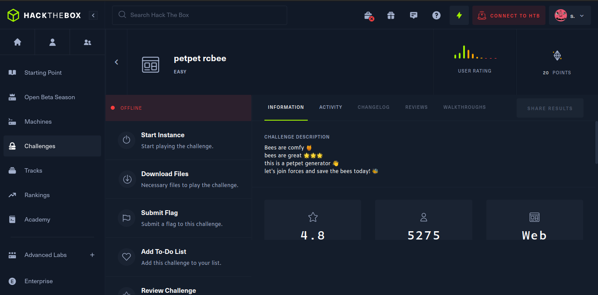
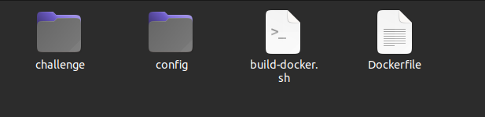
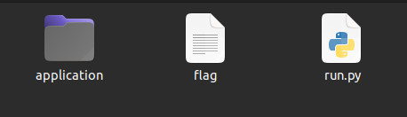
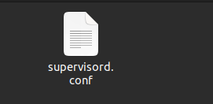
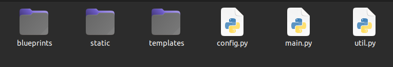
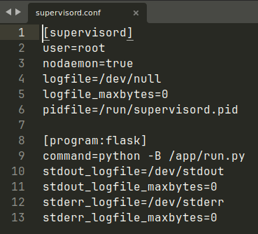
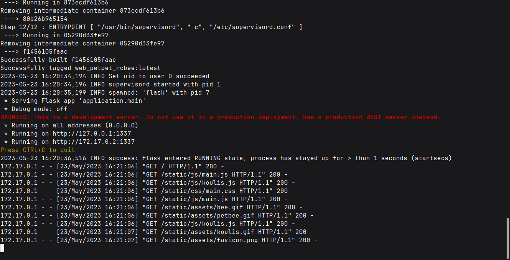
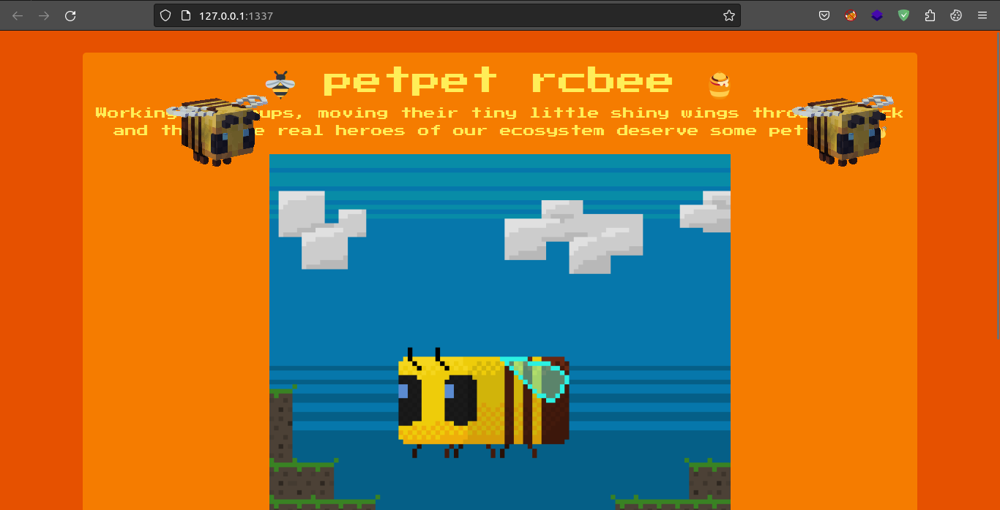

# Petpet Rcbee

### Challenge [Link](https://app.hackthebox.com/challenges/petpet-rcbee)



## Contents inside ZIP.



##### Inside `challenge` directory:


##### Inside config



##### Files inside application directory



### build-docker.sh

```sh
#!/bin/bash
docker rm -f web_petpet_rcbee
docker build -t web_petpet_rcbee . && \
docker run --name=web_petpet_rcbee --rm -p1337:1337 -it web_petpet_rcbee
```

1. `docker rm -f` removes any container named `web_petpet_rcbee` if it exists in the system forcefully specified by `-f`.
2. `docker build` builds command builds an image with tag name `web_petpet_rcbee` denoted by `-t` flag and ` . ` denotes the build context or the location of *Dockerfile*.
3. `docker run ` command creates container from the specified image i.e `web_petpet_rcbee`. `--name` specifies the name for the running container, `--rm ` removes the container when it stops running.This frees the port bind to the container and  provides fresh and consistent lab environment for each user.
4. `&&` between 2nd and 3rd commands ensures that the container is run only after building the image successfully.

### Dockerfile
```Dockerfile
FROM python:3

# Install system dependencies
RUN apt update -y; apt install -y curl supervisor 

# Install Python dependencies
RUN pip install flask Pillow

# Switch working environment
WORKDIR /tmp

# Install Pillow component
RUN curl -L -O https://github.com/ArtifexSoftware/ghostpdl-downloads/releases/download/gs923/ghostscript-9.23-linux-x86_64.tgz \
    && tar -xzf ghostscript-9.23-linux-x86_64.tgz \
    && mv ghostscript-9.23-linux-x86_64/gs-923-linux-x86_64 /usr/local/bin/gs && rm -rf /tmp/ghost*

# Setup app
RUN mkdir -p /app
WORKDIR /app

# Add application
COPY challenge .

# Setup supervisor
COPY config/supervisord.conf /etc/supervisord.conf

# Expose port the server is reachable on
EXPOSE 1337

# Disable pycache
ENV PYTHONDONTWRITEBYTECODE=1

# Run supervisord
ENTRYPOINT [ "/usr/bin/supervisord", "-c", "/etc/supervisord.conf" ]

```

- `FROM python:3` specifies the base image as  Python 3 which is the starting point for building Docker image.
- `RUN` command runs the specified commands to install the dependency on top of the base image.
- `WORKDIR` specifies the working directory in the image which is `/tmp`. It means the command run after this will run at `/tmp`.
- The `curl` command download a zip in `/tmp` directory, extracts it with `tar` ,move the binary to `/usr/local/bin/` as `gs` and remove the unwanted files from `/tmp`
```Dockerfile
# Setup app
RUN mkdir -p /app
WORKDIR /app
```
- It then creates `/app` directory and change the working directory to `/app`.
- `COPY challenge .` copies the challenge directory contents to the current working directory specified by `.`  which is `/app`.
- `COPY config/supervisord.conf /etc/supervisord.conf` copy the config to `/etc/supervisord.conf`.




- `EXPOSE 1337` exposes port 1337 of the container which can be mapped to another port of the host machine.
- `ENV` specifies the environment variable used by the flask app.
```Dockerfile
 ENTRYPOINT [ "/usr/bin/supervisord", "-c", "/etc/supervisord.conf" ]
```

- The `ENTRYPOINT` is the command run by container when it is started.

> Supervisor is a process management tool used in Docker container.Supervisor can start, stop, and restart processes, ensuring they are always running. If a process crashes or terminates unexpectedly, Supervisor can automatically restart it.

#### run.py
```python
from application.main import app

app.run(host='0.0.0.0', port=1337)
```

# Flow:
1. Remove any container named `web_petpet_rcbee` if exist.
2. Build a docker image using the Docker file.
3. Creates and run a container from the image built.
4. The ENTRYPOINT runs supervisord with its conig file.
5. The config file runs /app/run.py which runs the flask app in the container.

