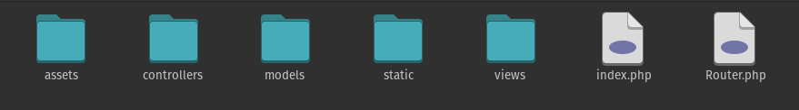

# Hack The Box Challange --> `lovetok` --> Overall Explanation Report

In this report we will be learning how does a hack the box challange in this case lovetok challange runs in our device and also learn about the files present in lovetok challange folder after extraction.

## Folder Overview
As we extract the hack the box challange zip file lovetok and then open the folder `LoveTok/web_lovetok` we will be seeing the following folders. A screenshot is attached below :


## Surfing through the files
Lets view what each file `build_docker.sh`, `Dockerfile`, and `entrypoint.sh` contains :

- `build_docker.sh` : 
    This file contains following code:
    ```sh
        #!/bin/bash
        docker rm -f lovetok
        docker build -t lovetok . && \
        docker run --name=lovetok --rm -p1337:80 -it lovetok
    ```
    - This first line says to make use of `bash` to interpert the script.
    - This second line says to forcefully remove if any instance of `lovetok` container is present.
    - The third line says to build the docker image named `lovetok` for the `Dockerfile` present in the current working directory.
    - The fourth line says to run the docker container named `lovetok` as denoted by `--name=lovetok` using the image named `lovetok` i.e. given in the end, map the `Port 1337` of the host machine to the `Port 80` of the container, run the created container in the interactive mode as given by `-it` and says to delete the container `lovetok` when the docker running stops.

- `DockerFile` :
    The DockerFile is seen containing following code:
    ```
        FROM debian:buster-slim

        # Setup user
        RUN useradd www

        # Install system packeges
        RUN apt-get update && apt-get install -y supervisor nginx lsb-release wget

        # Add repos
        RUN wget -O /etc/apt/trusted.gpg.d/php.gpg https://packages.sury.org/php/apt.gpg
        RUN echo "deb https://packages.sury.org/php/ $(lsb_release -sc) main" | tee /etc/apt/sources.list.d/php.list

        # Install PHP dependencies
        RUN apt update && apt install -y php7.4-fpm

        # Configure php-fpm and nginx
        COPY config/fpm.conf /etc/php/7.4/fpm/php-fpm.conf
        COPY config/supervisord.conf /etc/supervisord.conf
        COPY config/nginx.conf /etc/nginx/nginx.conf

        # Copy challenge files
        COPY challenge /www

        # Copy flag
        COPY flag /

        # Setup permissions
        RUN chown -R www:www /www /var/lib/nginx

        # Expose the port nginx is listening on
        EXPOSE 80

        # Generate random flag filename and start supervisord
        COPY --chown=root entrypoint.sh /entrypoint.sh
        ENTRYPOINT ["/entrypoint.sh"]

        CMD ["/usr/bin/supervisord", "-c", "/etc/supervisord.conf"]
    ```
    - The `first` line specifies the base image for the container. In this case, the base image is `debian:buster-slim`. This image is a lightweight version of the Debian operating system.
    - The `second` line creates a new user called `www`. This user will be used to run the web application.
    - The `third` line install the system packages that are needed to run the web application. These packages include `supervisor`, `nginx`, `lsb-release`, and `wget`. Also it will upadte system package is any updates are available.
    - The `fourth` line downloads the `php.gpg` file from the `sury.org` repository. This file is needed to install PHP packages from the `sury.org` repository.
    - The `fifth` line creates the `php.list` file, which specifies the `sury.org` repository as the source for PHP packages.
    - The `sixth` line installs the `php7.4-fpm` package. This package provides the `PHP FastCGI` process manager, which is used to serve `PHP applications`.
    - The `seventh`, `eighth`, and `ninth` respectively copy the `fpm.conf`, `supervisord.conf`, and `nginx.conf` files to their respective locations. These files configure the `php-fpm`, `supervisord`, and `nginx` processes.
    - The `tenth` and `eleventh` line copy the challenge and flag files to the `/www` directory. These files are the web application.
    - The `tweleveth` line sets the permissions on the /www and /var/lib/nginx directories to www:www. This ensures that the web application can be accessed by the www user.
    - The `thirtheenth` line exposes the `Port 80`. This allows the web application to be accessed from outside the container.
    - The `fourtheenth` line copies the `entrypoint.sh` file to the root directory and sets it as the entrypoint. This means that the `entrypoint.sh` file will be executed when the container is started.
    - The `fifteenth` line runs the `supervisord` command with the `-c` option, which specifies the `/etc/supervisord.conf` file as the configuration file. This will start the supervisord process, which will in turn start the `php-fpm` and `nginx` processes. The nginx process will listen on `Port 80`, and will serve the web application from the `/www` directory.

- `entrypoint.sh` :
    The `entrypoint.sh` is seen containing following code snippet:
    ```sh
        #!/bin/bash

        # Secure entrypoint
        chmod 600 /entrypoint.sh

        FLAG=$(cat /dev/urandom | tr -dc 'a-zA-Z0-9' | fold -w 5 | head -n 1)

        mv /flag /flag$FLAG

        exec "$@"
    ``` 
    The code is a Bash script that is used to secure the entrypoint of a Docker container. The script does the following:
    - The `first` line tells the Bash interpreter that the following code is a Bash script.
    - The `second` line sets the permissions on the `/entrypoint.sh` file to `600`. This prevents other users from reading or modifying the file and sets **read and write permissions** of `/entrypoint.sh` for owners of file only.
    - The `third` line generates a random 5-character flag. The `cat` command reads the contents of the `/dev/urandom` device, which provides random data. The `tr` command removes all characters from the output of the `cat` command except for `letters and numbers`. The `fold` command folds the output of the `tr` command into `5-character lines`. The `head` command prints the `first` line of the output of the `fold` command.
    - The `fourth` line moves the `/flag` file to `/flag$FLAG`. This renames the file with the random flag.
    - The `fifth` line executes the command that was passed to the script.

## The `flag` file
    ```
        HTB{f4k3_fl4g_f0r_t3st1ng}
    ```
The flag `HTB{f4k3_fl4g_f0r_t3st1ng}` is a security testing flag used in `Hack The Box`. It is a 13-character string that is used to identify a user as having successfully completed a security challenge. The flag is not used for any other purpose, and it does not grant the user any special privileges.

## Surfing through the folders 
The folders found and their use cases are:
- `challange` : The `challange folder` contains all the `static files`, `html files` and other `php files` that the challange `lovtok` is based upon.

    

- `config` : The `config folder contains` the configuration files for `fpm`, `nginx`, and `supervisord` which gets copied as specified in the file named `Dockerfile` earlier. 

    


