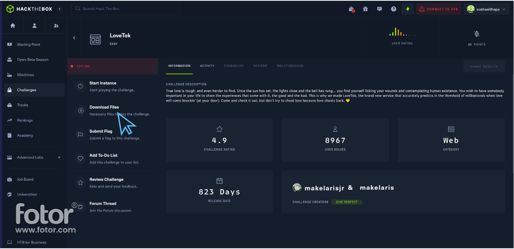
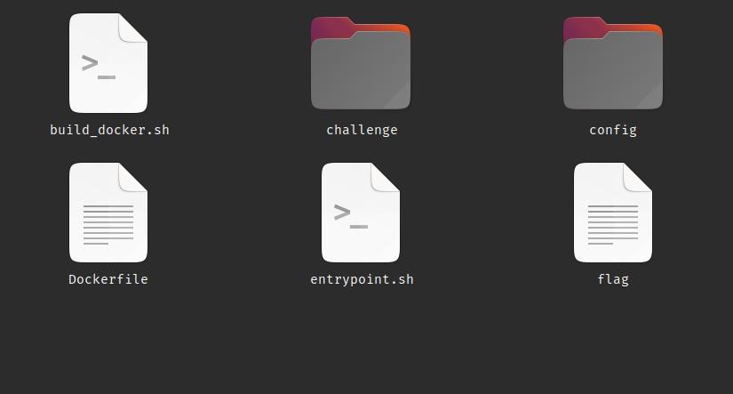

# Hack The Box Challange | `lovetok`

We will be discussing about the files that are present in the hack the box challanges.

Before explaning those files let's download the challange files we will be explaining.


### Downloading the `web_lovetok` HTB challanges

Note: **_You may have to create account in Hack The Box_**

- To download the HTB lovetok challange [click here](https://app.hackthebox.com/challenges/lovetok)
- Then, click on download button.

  

- After dowloading, extract the zip file. _You may have to enter password which is `**hackthebox**`_

When you open the folder `web_lovetok/` you will see following files.

- `build_docker.sh`
- `entrypoint.sh`
- `Dockerfile`
- `challange`(folder)
- `config`(folder)
- `flag`

  

We will be discussing `build_docker.sh`, `Dockerfile` and `entrypoint.sh` only

### Explaination of each files

#### `build_docker.sh`

<details>
<summary>Click here to view the code</summary>

The code for `build_docker.sh` is:

```sh
#!/bin/bash
docker rm -f lovetok
docker build -t lovetok . && \
docker run --name=lovetok --rm -p1337:80 -it lovetok
```

</details>

<details>
<summary>Click here for explanation</summary>

Let's dissect the above program and discuss what is happening is every line.

- `#!/bin/bash`

  It says that we will be using `bash` as a default interpeter to execute this script file.

- `docker rm -f lovetok`

  - `docker` is the **command line interface of docker**
  - `rm` stands for remove
  - `-f` is the option that stands for _force_
  - `lovetok` is the name of the Docker container to remove.

  To sum up, `docker rm -f lovetok` removes forcefully `lovetok` docker container if present

- `docker build -t lovetok .`

  - `docker` is the **cli** version of docker.
  - `build` is the subcommand is used to build docker image.
  - `-t` is the option that stands for _tag_
  - `lovetok` is the name of image we will be building
  - `.` is the path where docker will look for \*\*`Dockerfile`

  To sum up, `dokcer build -t lovetok .` will build docker image name `lovetok` for **`Dockerfile`** present in current directory.

- `docker run --name=lovetok --rm -p1337:80 -it lovetok`

  - `docker` is the **cli** version of docker
  - `run` is a subcommand that is used to run Docker container.
  - `--name=lovetok` is used to assign the name of container to _"lovetok"_
  - `--rm` is the option which is used to automatically remove the container after it stops.
  - `p1337:80` is the option that** maps the 1337 port of the host to the port 80 of container**
  - `-it` is the option to run the container in interactive mode.
  - `lovetok` is the name of image use for creating the container.

  Overall, `docker run --name=lovetok --rm -p1337:80 -it lovetok` command create container name `lovetok` from the docker image we have create i.e `lovetok` and map the `Port 1337` of host machine to `Port 80` of container, runs the container created in interactive mode and when the container stops docker will remove/delete the container.

</details>

#### `Dockerfile`

<details>
<summary>Click here for explanation</summary>

The code for `Dockerfile` is:

```dockerfile
FROM debian:buster-slim

# Setup user
RUN useradd www

# Install system packeges
RUN apt-get update && apt-get install -y supervisor nginx lsb-release wget

# Add repos
RUN wget -O /etc/apt/trusted.gpg.d/php.gpg https://packages.sury.org/php/apt.gpg
RUN echo "deb https://packages.sury.org/php/ $(lsb_release -sc) main" | tee /etc/apt/sources.list.d/php.list

# Install PHP dependencies
RUN apt update && apt install -y php7.4-fpm

# Configure php-fpm and nginx
COPY config/fpm.conf /etc/php/7.4/fpm/php-fpm.conf
COPY config/supervisord.conf /etc/supervisord.conf
COPY config/nginx.conf /etc/nginx/nginx.conf

# Copy challenge files
COPY challenge /www

# Copy flag
COPY flag /

# Setup permissions
RUN chown -R www:www /www /var/lib/nginx

# Expose the port nginx is listening on
EXPOSE 80

# Generate random flag filename and start supervisord
COPY --chown=root entrypoint.sh /entrypoint.sh
ENTRYPOINT ["/entrypoint.sh"]

CMD ["/usr/bin/supervisord", "-c", "/etc/supervisord.conf"]
```

</details>
<details>
<summary>Click here for explanation</summary>

Let's dissect the above program and discuss what is happening is every line.

- `FROM debian:buster-slim`

  `FROM` keyword is used to specify the base iamge for building the docker image. Here, `debian:buster-slim` is the base image which can be found in [Dockerhub](https://hub.docker.com/_/debian)

- `RUN useradd www`

  `RUN` keywords is used to execute the command line instrution.

  Here, it executes `useradd www` command which create a new user name "www" with default setting

- `RUN apt-get update && apt-get install -y supervisor nginx lsb-release wget`

  It will update the system packages and install `supervisor`, `nginx`, `lsb-release` and `wget` packages

- Adding the php repo and key

  ```dockerfile
  RUN wget -O /etc/apt/trusted.gpg.d/php.gpg https://packages.sury.org/php/apt.gpg
  RUN echo "deb https://packages.sury.org/php/ $(lsb_release -sc) main" | tee /etc/apt/sources.list.d/php.list
  ```

  These lines will add the `php` repo in our dependencies and also add `php key` is our config files.

- `RUN apt update && apt install -y php7.4-fpm`

  This will run two command `apt update` and `apt install -y php7.4-fpm`.

  - `apt update` will update the system packages
  - `apt install -y php7.4-fpm` will install php.

- Copying config file to `/etc`

  ```dockerfile
  COPY config/fpm.conf /etc/php/7.4/fpm/php-fpm.conf
  COPY config/supervisord.conf /etc/supervisord.conf
  COPY config/supervisord.conf /etc/supervisord.conf
  ```

  First line, copies the files from `config/fpm.conf` to ` /etc/php/7.4/fpm/php-fpm.conf`

  Second line, copies the files from `COPY config/supervisord.conf` to `/etc/supervisord.conf`

  Third lines, copies the files from `COPY config/supervisord.conf` to `/etc/supervisord.conf`

  Overall, it will copies the files present in out `config/` folder to respective location so the `php` and `nginx` can work well

- `COPY challenge /www`

  We have create a user with name `www` recently. Whenever we create a user,s ystem will automatically create a folder with that user name in root directory.

  `COPY challenge /www` command will copy the`challenge` folder into `/www` folder.

- `COPY flag /`

  It copies the file `flag` into the root directory.

- `RUN chown -R www:www /www /var/lib/nginx`

  It changes the ownership of the `/www` directory and `/var/lib/nginx` directory to the user and group `www:www`

- `EXPOSE 80`

  Expose the port on which nginx is listening on

- `COPY --chown=root entrypoint.sh /entrypoint.sh`

  It copies the `entrypoint.sh` files to the root directory and set the ownership of `entrypoint.sh` to `root` user.

- `ENTRYPOINT ["/entrypoint.sh"]`

  It is used to the default entry point for the Docker container if `/entrypoint.sh`. It means that whenever Docker Container will start then `/entrypoint.sh` will be executed.

- `CMD ["/usr/bin/supervisord", "-c", "/etc/supervisord.conf"]`

  `CMD` specifies the default command and arguments to be executed when running the Docker container.

  When we run the Docker container build on top the image create by this `Dockerfile`then `/usr/bin/supervisord -c /etc/supervisord.conf` will be executed as the default command inside the container.

  `/usr/bin/supervisord -c /etc/supervisord.conf` is used to start **supervisord**(a process control system) process with the specified configuration file as `/etc/supervisord.conf`

</details>

#### `entrypoint.sh`

<details>
<summary>Click here for explanation</summary>

The code for `entrypoint.sh` is:

```sh
#!/bin/bash

# Secure entrypoint
chmod 600 /entrypoint.sh

FLAG=$(cat /dev/urandom | tr -dc 'a-zA-Z0-9' | fold -w 5 | head -n 1)

mv /flag /flag$FLAG

exec "$@"
```

</details>
<details>
<summary>Click here for explanation</summary>

Let's dissect the above program and discuss what is happening is every line.

- `#!/bin/bash`

  It says that we will be using `bash` as a default interpeter to execute this script file.

- `chmod 600 /entrypoint.sh`

  `chmod` is used to change the permission of a files in Unix system.
  `600` is used to set the files permisson to read and write only.
  To sum up, above function set the **read and write** permission of `/entrypoint.sh` file for the owner.

- `FLAG=$(cat /dev/urandom | tr -dc 'a-zA-Z0-9' | fold -w 5 | head -n 1)`

  The above command consist of four different command. Let's explain them one by one.

  - `cat /dev/urandom`

    It is used to display the content of `/dev/urandom` in the terminal

  - `tr -dc 'a-zA-Z0-9'`

    `tr` stands for _translate_ , `-dc` are the option which stands for delete character from input and complements the character set and `'a-zA-Z0-9'` is the character set.

    The `tr` command take the output of `cat` command and remove all the character that are non alphanumeric.

  - `fold -w 5`

    `fold` command is used to wrap lines of text to specific width. `-w 5` specific the width to be of length 5.

    The `fold` commnad take output of `tr` command and wrap the line of text to width of 5.

  - `head -n 1`
    The `head` command takes output of `fold` command and dipslay the first line of the input

  To sum up, the file line output by `head` command will be store in `FLAG` variable.

- `mv /flag /flag$FLAG`

  `mv` command can used to rename the files or move the files.
  Here, it is used to rename the file named `/flag` to `/flag$FLAG`

  `$FLAG` will be replace with the value of `FLAG` i.e if `FLAG` = this then `/flag$FLAG` = `/flagthis`

- `exec "$@"`

  It is used to execute a command with the arguments provided to the script itself.

  For example:

  Suppose we have `a.sh` with following content:

  ```sh
  #! /bin/bash

  echo "Hello World"
  exec "$@"
  ```

  And we execute the script as

  `bash a.sh ls -lart`

  Then, the ourput will be

  ```
  Hello World
  [output of ls -lart]
  ```

  Here, the `exec "$@"` line is replace with the argument we have passed i.e. `ls -lart`

</details>

## Summary


The `builddocker.sh` script, `Dockerfile`, and `entrypoint.sh` script work together to build a Docker image with specific configurations and run a container based on that image. Here's a summary of each file:

`builddocker.sh`:

- The script uses `docker rm -f lovetok` to remove any existing Docker container named "lovetok".
- It then uses `docker build -t lovetok .` to build the Docker image - using the Dockerfile in the current directory and tags it as "lovetok".
- Finally, it runs the Docker container named "lovetok" with `docker run --name=lovetok --rm -p1337:80 -it lovetok`, mapping port 1337 on the host to port 80 in the container.

`Dockerfile`:

- Specifies a base image `FROM debian:buster-slim` which is a minimal Debian-based image.
- Creates a user named "www" using `RUN useradd www`.
- Updates the package lists and installs various dependencies such as `supervisor`, `nginx`, `lsb-release`, and `wget`.
- Adds a repository for PHP packages and installs `php7.4-fpm`.
- Copies configuration files for PHP-FPM, supervisord, and NGINX from the `config/` directory into the container.
- Copies the contents of the `challenge/` directory into the `/www` directory in the container.
- Copies a file named "flag" into the root directory in the container.
- Sets the ownership of `/www` and `/var/lib/nginx` directories to the "www" user.
- Exposes port 80 to allow inbound connections.
- Copies the `entrypoint.sh` script into the root directory of the container.
- Sets the entry point of the container to /entrypoint.sh.
- Specifies the command to run `/usr/bin/supervisord` with the configuration file `/etc/supervisord.conf.`

`entrypoint.sh`:

- Sets the permissions of the `entrypoint.sh` script to be more secure with `chmod 600 /entrypoint.sh`.
- Generates a random flag name using a combination of `cat`, `tr`, `fold`, and `head` commands.
- Renames the file `/flag` to `/flag$FLAG`, where $FLAG is the generated random flag name.
- Executes the command given as arguments to the script using `exec "$@"`.

These files collectively build a Docker image based on the Debian base image, configure PHP-FPM and NGINX, copy challenge files and a flag into the container, set permissions, generate and rename the flag file, and define the entry point and command to run when starting the container