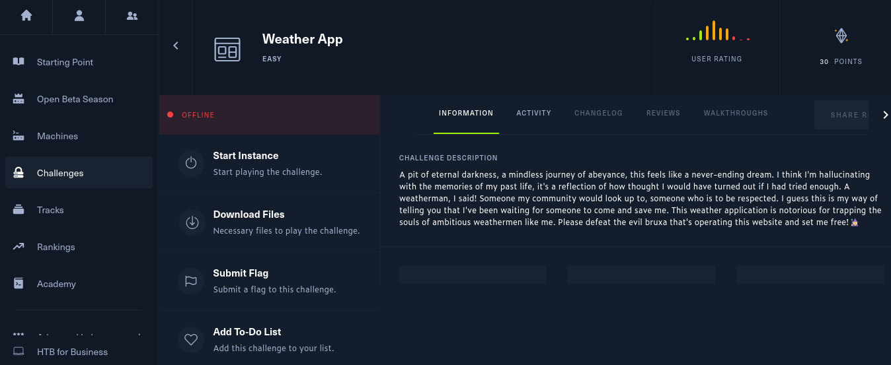
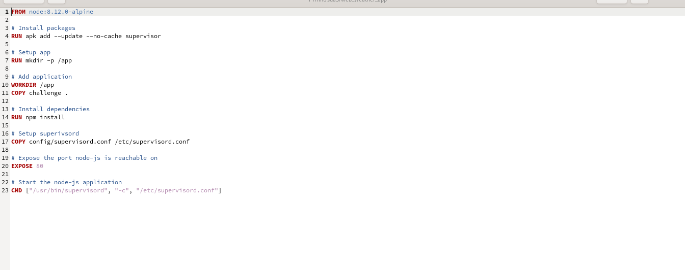

# HacktheBox Weather App

[Weather App](https://app.hackthebox.com/challenges/weather-app) is a HackTheBox challenge that is fairly easy and falls under Web category thus we'll be setting it up in our local machine using docker.

## Challenge Description
his weather application is notorious for trapping the souls of ambitious weathermen like me. Please defeat the evil bruxa that's operating this website and set me free! 🧙‍♀️

## Let's Go 



- Download the HTB Weather app challange by clicking on the Download Files button.

- After dowloading, extract the zip file. `unzip weather App.zip` When asked, Provide with password `hackthebox`

- Navigate into the recently unzipped folder web_weather_app `cd  web_weather_app` and you'll see the following files.

 ```
 build-docker.sh  challenge  config  Dockerfile
```

## Explaination of above files

### build-docker.sh
```
#!/bin/bash
docker rm -f weather_app
docker build --tag=weather_app .
docker run -p 1337:80 --rm --name=weather_app -it weather_app
```

Let's analyze the above program and discuss each line of code:
- `#!/bin/bash`

This line indicates that the script will be executed using the bash interpreter.

- `docker rm -f weatehr_app`
This command removes the Docker container named "weather_app" forcefully using the Docker command-line interface. It ensures that the container is deleted, even if it's currently running.

- `docker build --tag=weather_app .`
This command builds a Docker image with the tag "weather_app" using the Docker command-line interface. The -t/--tag option specifies the tag or name for the image. The . indicates that the Dockerfile used for building the image is located in the current directory.

- `docker run -p 1337:80 --rm --name=weather_app -it weather_app`
This command runs a `Docker` container using the Docker command-line interface. The `--name=weather_app` option assigns the name "weather_app" to the container. The `--rm` option automatically removes the container after it stops running. The `-p 1337:80` option maps port `1337` of the host machine to port `80` of the container. The `-it` option allows running the container in interactive mode, which enables user input and output. Finally, weather_app specifies the Docker image to use for creating the container.


### Dockerfile


Let's discuss each of line from above code
- `FROM node:8.12.0-alpine` is a Dockerfile instruction that sets the base image to a lightweight version of Node.js version 8.12.0 optimized for Alpine Linux.

-`RUN apk add --update --no-cache supervisor` is a Dockerfile instruction that installs the 'supervisor' package in an Alpine Linux-based image, ensuring it is up-to-date and without caching the downloaded package.

-`RUN mkdir -p /app`is a Dockerfile instruction that creates a directory named 'app' in the file system within the container image, ensuring that the parent directories are also created if they don't exist.

-`WORKDIR /app`is a Dockerfile instruction that sets the working directory within the container to '/app', which means subsequent commands will be executed in that directory by default.

-`RUN npm install` executes the command 'npm install' within the container, which installs the dependencies specified in the package.json file of the project being built.

-`COPY config/supervisord.conf /etc/supervisord.conf` is dockerfile instruction that copies the file 'supervisord.conf' from 'config' directory of the build context into '/etc/supervisord.config' location within the container

-`EXPOSE 80`the container will expose port 80 to allow incoming connections to the Node.js application.

-`CMD ["/usr/bin/supervisord", "-c", "/etc/supervisord.conf"]`This command specifies the command to be executed when the container starts, which in this case is running the supervisord process with the configuration file located at "/etc/supervisord.conf".